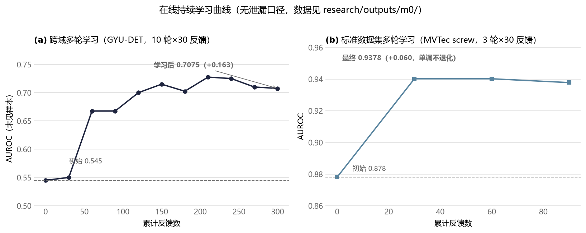
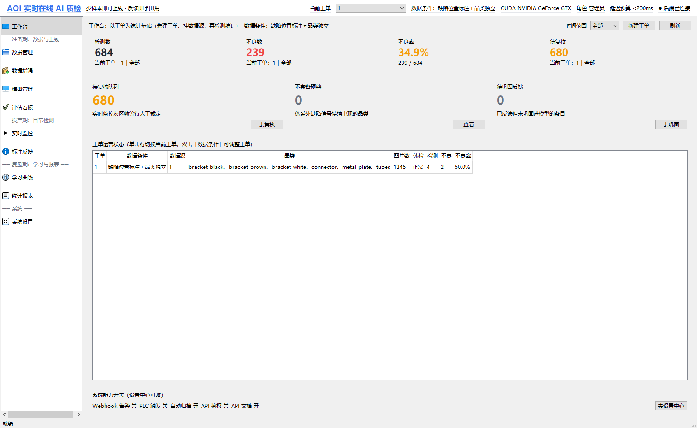
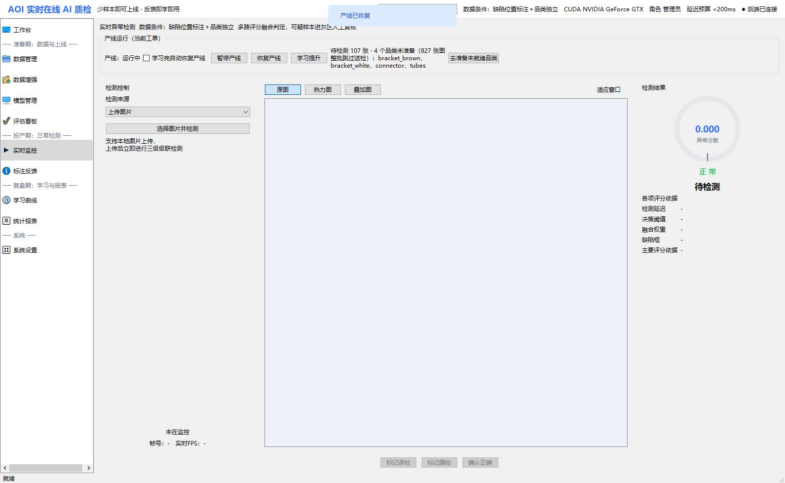
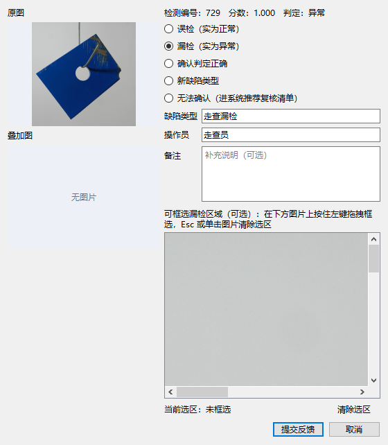

# 可自学习的AOI实时在线AI质检系统

> 第八届中国研究生人工智能创新大赛 · 华为赛题一（企业赛题）
>
> 版本：V3.1　日期：2026.09.01　团队名称：火眼工坊　参赛组别：企业赛题（技术创新）

---

## 目录

1. [项目概况](#1-项目概况)
   - 1.1 [背景和基础](#11-背景和基础)
   - 1.2 [场景和价值](#12-场景和价值)
   - 1.3 [所需支持](#13-所需支持)
2. [项目规划](#2-项目规划)
   - 2.1 [整体目标](#21-整体目标)
   - 2.2 [技术调研与创新点](#22-技术调研与创新点)
3. [实施方案](#3-实施方案)
   - 3.1 [技术可行性分析](#31-技术可行性分析)
   - 3.2 [技术细节](#32-技术细节)
   - 3.3 [计划和分工](#33-计划和分工)
   - 3.4 [数据、行业知识、算法、硬件来源与引用说明](#34-数据行业知识算法硬件来源与引用说明)
4. [参考资料](#4-参考资料)

---

## 记录更改历史

| 序号 | 更改原因 | 版本 | 作者 | 更改日期 | 备注 |
|------|---------|------|------|---------|------|
| 1 | 初稿 | V1.0 | 团队 | 2026.08.24 | 按第八届大赛项目文档模板撰写 |
| 2 | 作品定型 | V2.0 | 团队 | 2026.08.30 | 纳入主干系统 AOI_Core 与树枝系统 PCB_Dual；更新全部实测指标（U96-U121 算法攻坚、M10-M16 系统建设、首用质检修复）；新增数据生命周期管理章节 |
| 3 | 配图完善 | V2.1 | 团队 | 2026.08.31 | 新增总体架构图（图1）、在线学习曲线图（图2）与系统运行截图（图3-图8）；新增系统运行截图章节 |
| 4 | 评审补漏 | V2.2 | 团队 | 2026.09.01 | 补机器复判反馈源（外部传统 CV 回传自动映射三类反馈）——反馈闭环不限于人工 |
| 5 | 评审可读性重写 | V3.0 | 团队 | 2026.09.01 | 面向评审整体重写：叙事化表达、章节重组（2.2.1 问题定位→2.2.2 复测→2.2.3 选型逻辑→2.2.4 创新一~六）、弱化内部编号主线、软化对比结论口径 |
| 6 | 合并补充 | V3.1 | 团队 | 2026.09.01 | 在 V3.0 基础上补回：术语速查、§3.2.2 数据条件分档速查表（统一 L0-L3 与 UI"三档两开关"口径）、§3.2.3 特征注册表与三层评价/完备性机制、§3.2.10 产线部署关注点速览（一线+评审双视角）；恢复图1/图2/图3-图8 引用 |

---

> **术语速查**：SSOCL = 团队自研的反馈驱动持续学习机制（判对/判错/无反馈三类反馈闭环）；**槽位** = 统一契约 `{score, heatmap, confidence}` 的可插拔评分专家（正文亦称"多专家"）；**E_open** = 完备性哨兵（捕获未被任何命名特征组解释的信号）；**L0-L3** = 内部数据条件分层代号（§3.2.2 末速查表），UI 对用户呈现为"标注三档 + 两开关"，不露代号；**sanity 加权** = 利用初检缺陷标注对槽位按 AUROC 加权、反向槽置零；**A 再检 / B 泛化** = 学习效果双指标（已反馈样本 / 未见样本）；**大锚定** = eval_n≥40 的诚实复核口径；文中 U/M 编号为内部实验与里程碑流水号，仅作追溯用。

---

## 1 项目概况

### 1.1 背景和基础

AOI 质检的核心难点不是单纯提升某一数据集上的异常检测分数，而是在新品换型和新缺陷出现时，仍能以极少样本快速建立检测能力，并在真实运行中根据反馈持续修正。传统视觉依赖模板、ROI 和阈值配置；静态 AI 模型则通常训练一次后冻结，跨域变化后需要重新适配。

本项目围绕这一矛盾设计自学习 AOI 引擎：前端以统一分块方式处理大图，后端通过多个异常专家分别处理外观、微小缺陷、结构和逻辑等异质异常，再用统一校准和域差感知路由融合；检测完成后，用户或外部传统 CV 的反馈进入 SSOCL 闭环，形成可验收、可回滚的增量更新。

**已有工作基础**：经过五轮算法与系统迭代，团队完成轻量主干、少样本预训练、多专家槽位、域差感知融合、持续学习、在线服务与数据追溯等关键组件，形成完整可运行的 AOI_Core 主系统。

| 版本 | 核心探索 | 沉淀资产 |
|------|---------|---------|
| V1 | EfficientAD/DINOv2 骨干与蒸馏训练 | 轻量主干选型结论、CPU 部署路径 |
| V2 | GYU-DET 数据管线与在线学习原型 | 数据协议、位置记忆库原型 |
| V3 | 手工特征（blob/布局）与数据本地化 | 传统视觉特征体系、诚实评测协议 |
| V4 | 多分支融合与记忆库检测 | 速度安全网（161.9ms@2500²）、域差对抗特征、裁切图判别红利 |
| V5（本作品算法内核） | 槽位制专家 + 场景分层 + 在线 SSOCL | 完整可运行算法引擎（见 §3.2） |

评测过程中曾发现测试域配对差分导致虚高结果（V4 阶段 0.9983），团队据此建立了数据隔离、test 只验不选、独立验证和结果留痕的规则。正文只呈现经过复核后的主结论，特殊条件实验（如 L3 同源模板覆盖）单独披露，不归入无模板准确率结论。

**作品形态（一主一扩展）**：AOI_Core 为参赛主系统，PCB_Dual 作为传统 CV 复判和双引擎协同的工程扩展，用于验证既有工业算法如何成为持续学习的数据来源。

| 组成 | 定位 | 内容及验证边界 |
|------|------|---------------|
| **AOI_Core（主系统）** | 反馈驱动的 AI 质检原型 | PySide6 桌面端 + FastAPI 后端 + SQLite + Docker；具备多源检测、人工反馈、受控更新、学习曲线、版本管理与回滚、PLC 触发、缺陷归档、权限、审计和数据生命周期管理 |
| **PCB_Dual（扩展原型）** | 传统 CV + 特征引擎编排 | 算法目录按六组登记多个 PCB 检测项，并实现双路调度、SPC/CAD/双坐标和模拟 MES 网关；"已注册/可运行"不等于各检测项均已完成准确率验收，少量带 GT 样本结果仅作工程基线 |
| **复现包** | 算法研究与实验证据 | 实验脚本、配置、关键结果数据和设计记录；用于复核本地实验，不替代官方隐藏测试集评分 |

PCB_Dual 的定位是扩展验证而非官方准确率主体，正文重点展示 AI 与传统 CV 的反馈协同，不用算法登记数量替代精度证据。

### 1.2 场景和价值

**应用场景**：面向 3C 电子组装产线的 AOI 在线质检，支持图片与视频输入，对尺寸偏差、缺件少件、逻辑错误、色彩变化和常见外观异常进行检测，并输出位置、类型和追溯证据。

赛题覆盖通过"功能结果"呈现，而不是逐条解释"如何满足"。正文重点展示五类异常的实现路径和实测结果，末尾再用简表对照赛题功能要求：

| 赛题要求 | 对应模块 | 现有证据及边界 |
|---------|---------|---------------|
| 尺寸偏差 | layout 槽位 | 已实现统计比对；最终效果以官方测试集为准 |
| 缺件少件 | layout 槽位；有模板时可启用 tpl | 本地公开数据有归因实验；tpl 属额外模板条件 |
| 逻辑错误（顺序错误） | layout 槽位；有模板时可启用 tpl | 本地归因 top-1 为 0.562，仍是薄弱项 |
| 色彩变化 | color 特征组 | 本地归因 top-1 为 0.750，不外推至隐藏集 |
| 常见外观缺陷 | sem / disc / blob / texture 槽位 | 已完成公开数据实验，最终以官方测试集为准 |
| 视频输入 | 关键帧管线 + 时序平滑 | 已实现系统流程，不折算为准确率证据 |
| 少样本启动 | L1a：≤100 正常 + ≤30 缺陷 | 与官方默认协议对应；L0/L1b/L2/L3 为内部扩展分层 |

**PCB_Dual 补充说明**：算法目录按六组登记，当前量化基线仅覆盖 SMT 和金手指少量带 GT 样本；插件焊点自测缺少独立人工 GT。不得将目录数量表述为 20 项或 23 项均已验证，也不得将双引擎结果表述为互相证明准确。

**项目价值**：将 AOI 从一次性部署的静态检测器转变为可持续学习的质检工具，使新缺陷可以从反馈中沉淀为样例、专家能力和后续版本，降低新品适配对人工调参的依赖。

**对比性分析**：PatchCore、EfficientAD 等代表方法在工业异常检测上具有良好性能，但主要关注一次性检测；本项目进一步把少样本适应、异质异常专家、反馈学习和版本控制组织在同一运行闭环中。该比较仅说明设计取向，不声称覆盖全部商业 AOI 产品。

### 1.3 所需支持

- **算力**：开发期使用 GTX 1660 SUPER（与赛题 2060 级别相当）完成全部实测；推理目标平台为 2060 及以下 GPU，另有纯 CPU 降配模式。
- **硬件**：普通 x86 服务器/工控机即可部署，无特殊设备依赖。
- **数据**：使用公开数据集 MVTec AD、BTAD、MPDD、GYU-DET 及团队自建 data_local 数据完成训练与泛化验证（均为公开/自采数据，无商业数据）。
- **培训/文档**：已产出设计文档、模型使用说明、可解释性文档（见"其他辅助材料"），可支撑他人复现。

---

## 2 项目规划

### 2.1 整体目标

项目总体目标：构建一套能够真正运行和持续演进的 AOI 在线质检系统，用一条完整闭环证明"少样本上线之后，系统仍能通过反馈继续学习"。

1. **系统级目标**：完成图片/视频检测、少样本冷启动、多专家融合、反馈学习、版本验收、结果追溯和产线接口；
2. **指标级目标**：
   - 实时：2500×2500 输入在 2060 级 GPU 上保持模型段低于 200ms，并以相机帧直接进入内存的方式进一步降低现场 I/O 开销；
   - 检测：在 MVTec、BTAD、MPDD 等公开数据集上建立稳定基线，并用 GYU-DET 与 data_local 观察跨域适应效果；最终官方成绩以隐藏测试集为准；
   - 学习：让人工或机器复判反馈能够进入 SSOCL，推动样例库、路由和轻量参数更新，并通过回归门控和回滚控制模型漂移；
3. **工程性目标**：提供可复核的模型说明、实验脚本、系统运行记录和版本追溯能力。

### 2.2 技术调研与创新点

#### 2.2.1 为什么现有 AOI 方案难以持续适应

AOI 异常具有明显的异质性：外观瑕疵适合特征相似度或判别模型，微小缺陷需要高分辨率局部检测，尺寸/缺件/顺序又更接近结构统计和规则判断。把这些异常全部压进一个模型，既不利于解释，也会放大少样本条件下的过拟合风险。

| 方案 | 少样本适配 | 在线学习 | 速度（2500² 级） | 可解释性 | 与本赛题的差距 |
|------|-----------|---------|----------------|---------|---------------|
| PatchCore [8] | 需全量正常样本建记忆库 | 无 | 慢（全库 kNN 检索） | 定位级 | 新域需重建记忆库，无在线适应 |
| EfficientAD [2] | 需正常样本 + 蒸馏训练 | 无 | 快（毫秒级） | 定位级 | 逻辑异常依赖配准、对域差敏感；无反馈闭环 |
| AnomalyCLIP [9] | 零样本 | 弱 | 慢（ViT-Large 级） | 弱 | 大模型推理开销不满足 <200ms 硬约束 |
| RealNet [7] | 合成异常训练判别头 | 无 | 中 | 中 | 判别头对域外分布泛化有限 |
| AHL [1]（赛题指定文献） | 监督少样本 | 无 | 中 | 中 | 开放集建模思路可借鉴，但无实时速度与在线学习设计 |
| FastFlow/SimpleNet | 正常分布密度假设 | 无 | 中 | 中 | 跨域（train/test 域差）下密度估计失效 |
| **本系统** | **L0-L3 场景分层** | **三类反馈 SSOCL 闭环** | **GPU 模型段 p50 58ms / CPU e2e 351ms** | **判定→定位→归因→追溯四层** | — |

因此，本项目采用"多个小专家 + 统一融合 + 在线更新"的路线，让每种异常由更合适的判别机制处理，再通过统一接口输出分数、热力图和置信度。

#### 2.2.2 少样本条件下的代表性对比

为了判断冷启动策略是否真的有效，团队在 100 张正常图 + 不超过 30 张缺陷图的统一条件下，对本系统、PatchCore 和 EfficientAD-S 进行了五个代表性品类的复测（test 全量图像级 AUROC，GTX 1660 SUPER 实测）：

| 品类 | 本系统（100+30） | PatchCore-fs（100 正常）[8] | EfficientAD-S-fs（100 正常）[2] |
|------|----------------|---------------------------|-------------------------------|
| bottle | 0.9985 | 1.0000 | 0.9992 |
| capsule | 0.9252 | 0.9625 | 0.8472 |
| cable | 0.9619 | 0.9591 | 0.9526 |
| transistor | 0.9633 | 0.9712 | 0.9808 |
| screw | 0.8715 | 0.8643 | 0.5940 |
| **平均** | **0.9441** | **0.9514** | **0.8748** |

结果显示，本系统平均 AUROC 0.9441，EfficientAD-S 为 0.8748，PatchCore 为 0.9514。项目并不以"全面超过 PatchCore"为结论，而是证明在低数据量条件下，冻结通用特征与多专家融合能够保持接近代表性 SOTA 的水平，同时增加持续学习、解释与实时部署能力。复测记录见辅助材料。

#### 2.2.3 技术选型与创新逻辑

技术路线围绕赛题的四个实际难点建立：少样本冷启动、异质异常覆盖、反馈驱动优化和实时部署。每一个选择都由对照实验先验证，再进入系统。

| 官方评分项 | 本作品提交证据 | 不计入该项的材料 |
|-----------|---------------|-----------------|
| 方案完整度 50% | AOI_Core 可运行流程、人工反馈、候选更新审核、版本回滚、追溯与提交材料 | PCB_Dual 算法注册数、模拟 MES 不表述为真实产线集成 |
| 准确率 20% | 最终以官方隐藏测试集为准；本地 L1a 同协议和公开数据实验只作赛前预估 | L3 同源模板覆盖结果、PCB_Dual 少量案例、注册项数量不折算为准确率 |
| 检测时间 30% | 主报官方要求的 2500² 模型运行时间，并同时披露 IO、前后处理和端到端口径 | 并发服务内部统计不替代单图计时；客户端排队耗时单独披露 |

1. **少样本**：跨品类预训练 + 冻结通用特征，减少目标品类端到端训练（U11：冻结 0.6032 > 微调 0.4914 > 从零 0.4235）；
2. **实时性**：冻结 DINOv2 主干，只训练轻量判别头和路由，建立可控的 2500² 速度工作点（不采用 ViT 大模型路线）；
3. **在线学习**：不采用无人值守全量重训，而采用判对/判错/无反馈三类反馈驱动的小步更新，并通过锚定回归控制模型漂移；
4. **未知缺陷**：利用 E_open 发现现有专家无法解释的异常信号，再触发新特征或新专家的孵化；
5. **可解释**：每次异常输出都能回溯到主导槽位、分数分解和更新链。

#### 2.2.4 核心创新与实测证据

- **创新一——槽位制多专家架构**：将异常检测拆成 semantic、discriminative、blob、traditional、layout、inp、template 等可插拔专家，使外观、微小缺陷、结构和模板异常可以按各自机理处理；
- **创新二——场景分层与轻量冷启动**：根据可获得的数据条件逐层激活能力；在默认 100+30 少样本条件下，目标品类只进行校准、记忆库和轻量路由初始化，通用主干和判别能力来自公开数据预训练；
- **创新三——域差感知软路由 + E_open**：不是手工设定固定权重，而是根据各专家分数和域差统计动态调整融合；E_open 用于监测"已有专家是否没有解释完整"；
- **创新四——SSOCL 持续学习**：反馈进入双库、缺陷样例拦截、主动选样和轻量参数更新，并通过锚定集门控和版本回滚控制风险；
- **创新五——机器复判参与学习**：传统 CV 可以作为外部复判源，AI 与传统 CV 的冲突自动形成误检/漏检反馈，扩大反馈来源，降低对人工逐张标注的依赖；
- **创新六——实时与工程闭环**：GPU 速度模式 2500² 模型段 p50 58ms、mean 102ms；同时保留 CPU 降配路径和完整追溯链。

上述创新均在后续实验章节中以"方法→结果→边界"的方式展开。

---

## 3 实施方案

### 3.1 技术可行性分析

- **数据可行性**：使用 MVTec AD、BTAD、MPDD、GYU-DET 及团队自采工业数据建立通用能力、跨域验证和在线学习实验；官方测试前的目标品类适配与测试数据严格分账。
- **知识可行性**：以 AOI 常见异常类型为知识骨架，建立槽位到异常类别的规则化解释体系；传统 CV 提供几何、逻辑和模板先验。
- **硬件可行性**：主要实测在 GTX 1660 SUPER 完成，同时支持 CPU 降配模式；软件侧提供 FastAPI、桌面端、SQLite、Docker、PLC 触发、归档、审计与版本能力。
- **关键技术风险与对策**：
  - 速度风险通过冻结主干和速度工作点控制（§3.2.6，另有 demo4 161.9ms 安全网）；
  - 跨域风险通过反馈学习与数据条件分层缓解——跨域实验表明，反馈学习能够显著改善部分真实域差场景，但强域差品类仍可能出现负增益，因此更新必须经过独立评估与版本审核；
  - 少样本过拟合风险通过公开数据预训练 + 冻结策略缓解（U11：冻结 0.6032 > 微调 0.4914 > 从零 0.4235）。

### 3.2 技术细节

#### 3.2.1 总体架构

```
离线冷启动（L1a 标准场景：≤100 正常 + ≤30 缺陷）
  A. 分块         L1:512² 全量精检（所有块过全部槽位，不做过滤式快筛）
                 L2:256² 高危块追加细判（只做加法，不损失召回）
  B. 特征注册表   DINOv2 tile 级 patch token（主干永冻）+ 手工特征 7 组，逐组带贡献档案
  C. 评分槽位     {sem, disc, blob, trad, layout, inp, tpl} + E_open 哨兵
                 每槽位输出 tile 级 {score, heatmap, confidence}
  D. 校准         每槽位分数在 train/good 上做经验 CDF → [0,1] 同语义尺度
  E. 域差感知路由  线性软路由：输入=各槽位校准分+域差统计 → 逐槽位 softmax 权重
  F. 决策输出      图像分 S=Σw·s（top-k tile 聚合）→ 热力图 H=Σw·H → 连通域检测框
  (视频模态: 关键帧 → 同一管线 → 时序平滑)

在线 SSOCL（持续学习主角）
  G. 三类反馈      判对加固 / 判错定向修 / 无反馈置信过滤
  H. 模式管理      新正常模式成簇入库（锚定+扩展双库制），孤立高分样本永不入库
  I. 缺陷样例库    确认缺陷 1-2 张即建近邻拦截通道；同类攒够 → 孵育专属判别头
  J. 特征演化      E_open 捕获未解释信号 → 不完备报告 → 特征孵化 → 新组注册
  K. 版本与回滚    库快照 + 锚定集回归门控，退化即回滚
```


#### 3.2.2 少样本冷启动

冷启动采用"通用能力先验 + 目标品类轻量适配"。MVTec 跨品类正常图和伪异常用于训练通用判别头，目标品类仅做校准、记忆库和路由初始化。gold_finger 三模式对照显示冻结 0.6032、微调 0.4914、从零 0.4235，冻结策略兼顾精度与低训练开销（免去 256s 训练，fit 仅 14s）。

伪异常采用可控的工程生成方法（借鉴 RealNet 合成异常思路 [7]，不用 GAN：130 样本训练不稳、不可解释），目标是让判别头学习"哪些局部变化不符合正常分布"，而不是依赖大量真实缺陷样本。

DINOv2 [3] 作为冻结 patch 级特征主干，用共享通用表示减少小样本端到端训练的不稳定性。L0 用于无标注情况下建立初始阈值；L1a 用于赛题默认的 100 正常 + 30 缺陷场景；更强结构先验只在有相应数据条件时启用。

**预训练/迁移协议分账（诚实声明，回应赛题"测试集运行前仅用 100+30 迁移学习"）**：

| 阶段 | 使用数据 | 用途 | 是否进入目标品类 fit |
|------|---------|------|---------------------|
| 预训练（公开数据集） | MVTec 14 品类 train/good 正常图 560 张 + 伪异常合成 | 训练通用判别头 disc（赛题明确允许"利用公开数据集进行模型训练"） | 否——目标品类上**冻结只读**，不参与拟合更新 |
| 冷启动 fit（L1a） | 目标品类 ≤100 正常 + ≤30 缺陷（赛题协议） | 槽位 CDF 校准、记忆库、路由初始化、决策阈值 | 是——仅此阶段使用目标品类数据 |
| 在线学习 | 操作员反馈（测试集运行过程中产生） | SSOCL 三类反馈更新（库/权重/校准） | 仅经反馈接口，严格留痕可回滚 |
| 评测 | 测试集 1000+ 图 | 只验不选，无任何训练作用 | 否——代码断言 test 域进入 fit 即报错 |

所有目标品类适配步骤均可追溯，测试数据不进入训练与选参流程；全部训练日志可追溯每个参数见过什么数据（设计文档 §9.1）。

**机器复判反馈源（2026-08-31 落地）**：PCB_Dual 对同一图像进行独立判断，通过机器复判接口返回 AI 与传统 CV 的差异。AI 判 NG 而传统 CV 判 OK 映射为误检反馈；AI 判 OK 而传统 CV 判 NG 映射为漏检反馈；两侧一致则形成确认强化。机器反馈与人工反馈同驱动 SSOCL 即学、同受幂等/作废/留痕协议约束，反馈来源字段标注外部引擎来源，可追溯——产线上任何成熟检测引擎都可作为反馈供给方。

**数据条件分档处理速查（L0-L3 内部代号 ↔ UI"标注三档 + 两开关"）**：系统按"用户实际拥有的标注/素材"分档处理，而非为单一协议设计——

| 档位 | 用户需提供 | 激活能力 | fit 处理 | 适用场景 |
|------|-----------|---------|---------|---------|
| L0 零样本 | 仅正常图（可少量） | blob/trad/layout 兜底 + 正常分位数阈值 | 仅正常分位数阈值 | 新品类应急上线 |
| L1a 图像级标注（赛题默认） | ≤100 正常 + ≤30 缺陷 | 全槽位 + CDF 校准 + 软路由 | 槽位 CDF 校准、记忆库、路由初始化、决策阈值 | 标准协议评测、常规产线部署 |
| L1b 定位标注 | 缺陷位置框/掩码 | + 判别头精调定位与归因 | 含定位监督 | 有标注体系的产线 |
| L3 模板比对 | 金样板（模板目录、模板命名规范，或 UI 右键设为模板） | + tpl 模板差分（域不变） | 模板库 + TplCalibrator + 决策闸门 + 相位相关配准 | 强配准品类（PCB） |

口径说明：内部代号另有 L2（限定品类）一层，当前未单独启用；UI 面向用户不暴露 L 代号，落地为"标注三档（仅正常图 / 图像级标注 / 缺陷位置标注）+ 两开关（品类独立 / 模板比对）"，由工单条件自动聚合折算；官方评分对账仅采用 L1a 口径。判断路径：**有金样板 → L3；有正常+缺陷图 → L1a；只有正常图 → L0 应急或 L1a 降级（判别头仅伪异常训练）**。各档分步操作流程详见辅助材料《数据条件与数据集适配指南》§4。

#### 3.2.3 多专家评分槽位

槽位之下是统一的**特征注册表**（每组带贡献档案，可独立裁剪/升级）：

| 特征组 | 构成 | 对口缺陷 |
|--------|------|---------|
| DINO-patch | DINOv2 tile 级 patch token（384d，主干永冻） | 通用语义特征，供 sem/disc/tpl/inp/open 槽位 |
| color | HSV 直方图 + 色彩矩 | 色彩变化 |
| geometry | Hu 矩 / 轮廓 / HOG | 尺寸偏差、缺件 |
| texture | GLCM / Gabor / LBP / Haar | 划痕、纹理异常 |
| freq | FFT / 小波 | 周期结构异常 |
| blob | LoG / SURF | 斑点、污染、微小缺陷 |
| logic | 连通域 / 对称性 | 逻辑错误 |
| material | 反光 / 高光 | 材质异常 |

**特征选取方法（三层评价，回答"哪些特征独立、真正起作用"）**：① 单变量层——逐组 tile 级区分度（L1a 用 MIL-topk AUC，L1b 用 pixel PRO）；② 冗余层——组间相关/互信息聚类，冗余组合并或只留代表；③ 消融层——留一组（leave-one-group-out）对融合分数的影响。全部**按缺陷类型切片**评估（色彩组对色偏强、对划痕弱，全局平均会销毁信息），产出贡献档案并开放 API 给 UI 可视化（每组有没有用、该不该留，界面直接可读）；裁剪方针为"先全量达标，再按贡献裁剪提速，裁剪前后回归"。

**完备性机制（回答"有没有没设计到的特征"）**：E_open 对 DINO tile 特征做密度/重构兜底建模，语义为"存在无法被任何命名特征组解释的信号"——只捕获、不解释；判错难例若所有命名组分数平坦或 E_open 持续偏高，系统自动出具"疑似体系外缺陷"不完备报告；积累难例自动试算候选特征（新感受野、频域新基、轻量适配器），区分度达标即注册为新命名组进入路由——不完备从失败变成工作流。详见辅助材料《算法引擎设计》§3。

| 槽位 | 原理 | 应对缺陷 |
|------|------|---------|
| sem | DINOv2 tile 级 coreset 记忆库（借鉴 PatchCore [8]）+ top-k 聚合 | 语义级外观缺陷 |
| disc | 伪异常训练判别头（借鉴 RealNet [7]，"避开异常"目标） | 一般外观缺陷 |
| blob | cv2 DoG 全分辨率斑点检测 | 微小外观缺陷（gold_finger 关键） |
| trad | 手工特征（color/geometry/texture/freq/logic/material） | 色彩变化、纹理异常 |
| layout | 元件尺寸/缺失/顺序统计比对（无需模板） | 尺寸偏差、缺件少件、逻辑错误 |
| inp | 图像内 patch 自相似（inpainting 式判异） | 局部结构异常 |
| tpl | 显式模板差分（L3 层） | 强配准品类（PCB） |
| 孵育头 | 开放集异质性建模（借鉴 AHL [1]），同类缺陷攒够后孵化 | 新出现的未知缺陷族 |

各槽位先做 CDF 校准，再由域差感知路由融合；这样不同专家的分数可以落在统一语义空间，同时根据场景动态调整贡献。sanity 加权在数据域可用时进一步剔除反向槽位。

#### 3.2.4 反馈驱动的受控持续学习（SSOCL）

SSOCL 将反馈分为判对、判错、无反馈三类。判错样本进入缺陷样例库并触发针对性更新；判对样本用于正常模式加固；无反馈样本仅在满足一致性和置信条件时缓存。更新任务设置时延上限（3000ms），超过上限转后台异步执行，不阻塞主检测链路。

确认缺陷 1~2 张即可建立近邻拦截通道；更多反馈后，系统可进一步更新路由与轻量判别能力。在特定本地实验中，6-13 条反馈后观察到 F1 +0.37~0.48——该结果不构成后续同型缺陷必然检对的承诺。

在线学习同时报告已见样本再检（A 再检）与未见样本泛化（B 泛化），避免把记住样本误认为真正泛化。候选版本必须经过锚定集回归后才激活，退化则回滚并留痕。

**学习曲线核心实测**（GYU-DET 跨域，train 域拟合 / test 域测试，无泄漏）：

| 实验 | 初始 AUROC | 学习后 AUROC | 提升 | 峰值 |
|------|-----------|-------------|------|------|
| U51（shead 启用 + 在线权重学习） | 0.6232 | 0.7665 | +0.143 | 0.8180@20 反馈 |
| U60（判别头调参） | 0.6360 | 0.7941 | +0.158 | 0.8051 |
| U62（+虚高检测重校准） | 0.6360 | **0.8180** | +0.182 | 0.8199 |
| 多轮持续学习（10 轮 300 反馈） | 0.5450 | 0.7075 | +0.163 | 0.7275 |

**真实工业域差（data_local）在线学习实测（U92，2026-08-24）**——赛题"换线后跨域适应"场景的直接答卷：

| 品类 | 静态基线 | 学习后 | 提升 | A 再检（学过就会） |
|------|---------|--------|------|-------------------|
| gold_finger | 0.1222 | **0.6080** | +0.486 | 0.5583 |
| solder_smt | 0.2346 | **0.5309** | +0.296 | 0.5652 |

真实工业域差 data_local 中，gold_finger 约 0.12→0.61，solder_smt 约 0.23→0.53；多轮大锚定复核后 gold_finger 约 0.72，说明反馈闭环对真实域差具有实际适应效果。该结果依赖具体数据和反馈序列，不外推为任意品类、任意批次的严格单调保证。

**跨域大锚定诚实复核（U121，2026-08-26）**——修正早期小锚定虚高数字：

| 口径 | gold_finger 学习后 | 判定 |
|------|-------------------|------|
| 小锚定（eval 20 张，18 缺陷+2 正常） | 0.9091 | ⚠️ 类别极不平衡，AUROC 噪声大 |
| **大锚定（eval_n=40）** | **0.7148-0.7227** | ✅ 真实水平 |

结论：data_local 在 **L1a 默认协议（100+30，无模板）** 的本地实验约为 **0.60（单轮）→ 0.72（多轮）**，而非早期小锚定口径的 0.91；该结果仅描述该数据集与实验配置，不定义官方测试集上限。

**L3 模板覆盖实验（2026-08-30，非官方默认协议）**：系统链路验证了"用户另行提供金样板"时的模板差分组合，但实验具有闭集和同源覆盖条件：

| 配置 | gold_finger（12 缺陷 + 5 正常） | 判定 | latency |
|------|--------------------------------|------|---------|
| 模板 8 张（初版系统上限） | AUROC 0.5667、tpl 反向 | 8/17 | 3332-7131ms |
| 全库模板 85 张 + 纯特征差分 + 校准修复 + 配准 + 决策闸门 | **AUROC 1.0000** | **17/17** | p50=484ms |

三项工程改进：① prepare 模板收集上限放开（8→500，覆盖正常样式分布）；② tpl 像素差分默认关（速度 3-7s→0.2-0.5s）+ TplCalibrator 线性归一化（修复 CDF 校准失真）+ 决策闸门（与金样板一致强判正常，含小缺陷 heatmap-max 保护）；③ tpl 相位相关配准（对位漂移 50px 测试：像素差 19.35→1.58，配对场景自动跳过）。**持续学习组合验证**：L3 模型 + 反馈巩固 v2 后 AUROC 保持 1.0、学习链路不破坏。

验证边界：模板库使用了训练正常图与测试正常图的修复图，和评测正常样本同源，AUROC 1.0000 是闭集模板覆盖结果；仅使用隔离的训练正常图 68 张作为模板时实测 AUROC 为 **0.27**——效果高度依赖模板覆盖度。模板模块采用配准 + 差分 + 校准 + 决策闸门，适合强配准产线；模板覆盖不足时，系统仍回到通用 AI 和反馈学习路径。L3 与 L1a 属不同数据条件，两种结果不可混报。

**学习稳定性**：通过分级冻结、锚定回归和版本回滚降低退化风险；6 个标准品类实验中未观察到学习后退化，但这只是特定样本与反馈序列的结果，不构成"越学越准"的普遍保证。强域差品类仍可能出现负增益，这一边界保留在验证章节，不影响系统"可反馈、可审核、可回滚"的总体机制。

> **诚实边界（门控非硬保证）**：跨域 MPDD bracket_brown 在最终对比中仍登记 **−0.3422 负增益**（同批 transistor −0.0217、tubes −0.0111，`research` final_comparison）。现有锚定集以正常图为主，对缺陷侧召回退化约束不足。因此更新只能称为概率性改善，必须经独立评估和版本审核；L3 模板也不能替代该审核。

**多轮更新实验记录（U111，2026-08-26）**：

| 品类 | 轮数/反馈 | 初始 → 最终 | 轮间序列 | 判定 |
|------|----------|------------|---------|------|
| screw（MVTec） | 3 轮 × 30 = 90 | 0.8780 → **0.9378**（+0.060） | 0.9402/0.9402/0.9378 | 本次实验总体提升，末轮略有回落 |
| gold_finger / solder（跨域） | 多轮 | 早期小锚定 0.91-0.92 | 多轮 > 单轮 | 该数字受小锚定影响，不作主结论；主报大锚定 0.7148-0.7227 |



A 再检/错→对转化率等决策级指标如实登记（部分受阈值饱和限制，见可解释性文档盲区声明）。

#### 3.2.5 分层可解释输出

| 输出层 | 内容 | 来源 |
|--------|------|------|
| L1 判定 | 正常/异常 + 校准分数 + 灰区 | 融合分数 + 双阈值 |
| L2 定位 | 检测框 + 像素级异常掩码 | 融合热力图 → 阈值化 + 连通域 |
| L3 类型归因 | 五类异常标签 + 置信度 + 证据 | "槽位→类型"规则化映射矩阵（可核验） |
| L4 追溯 | 主导槽位 + 分数分解 + 更新链 | 追溯接口（推理记录与审计日志） |

#### 3.2.6 速度实测与部署

**双工作点**（全部实测，GTX 1660 SUPER；轻量化思路参考 EfficientAD [2]）：

| 工作点 | 配置 | 2500² 耗时（模型段） | 达标 |
|--------|------|-----------|------|
| 速度模式 | 仅 sem/disc/shead 三强 GPU 槽（m0_fast） | **p50 58ms / mean 102ms / p95 183ms** | ✅ <200ms |
| 全槽位 | 448px single 裸基线 | 467-1006ms | 精度优先 |
| CPU 降配 | 纯手工槽位（blob/trad/layout），无网络 | 模型段 mean 257ms / e2e mean 351ms | ✅ <2s |

速度模式采用高贡献 GPU 槽位组成实时工作点，满足赛题要求的 <200ms 模型运行时间目标。完整链路另行披露图像 I/O、前后处理和并发耗时；正式结论以题面模型运行口径为主，工程链路作为部署补充证据。

| 口径 | 数值 | 含义 |
|------|------|------|
| 算法推理耗时（速度模式） | 2500² 模型段 p50 58ms / mean 102ms / p95 183ms | sem/disc/shead 三槽 GPU 推理，**不含**图像 IO 与前后处理；即赛题"模型运行时间"口径，达标（n=30，实测记录见辅助材料） |
| 系统全链路（大图实拍，2026-08-31） | **4096×3000（12MP >2500²）零拷贝 e2e 均值 131ms / p95 172ms / max 224ms** | 相机帧接口直入内存（解码+切块+前向+融合，不含磁盘 IO）；本次串行样本未观察到 >1s。该结果不代表并发场景下实际耗时 |
| 系统全链路（小图/常规尺寸） | 1024² 零拷贝 e2e 均值 73ms / p95 134ms | 同上接口 |
| 系统全链路（磁盘路径） | 4096×3000 冷缓存 e2e 均值 292ms / p95 333ms（首图读盘含 IO）；热缓存（复检）e2e 均值 72ms / p95 141ms | 图像文件接口引擎读盘口径 |
| 并发工程观察（非官方计分口径） | 200 轮×4 请求，共 800 次；服务内部处理统计 p50 143ms / p95 344ms / max 560ms | 该数字不含客户端排队，不能称为并发端到端时延，也不用于官方检测时间对账 |
| 并发耗时 | 客户端实测 p50 263ms / p95 597ms / max 1740ms | 已出现单请求 >1s，说明当前实现不承诺突发 4 并发下单图 <1s；正式演示采用串行/限流。并发能力只作工程观察，不表述为产线吞吐已验证 |
| CPU 降配全链路 | 2500² e2e mean 351ms / p95 368ms | 纯手工槽位，无 GPU 亦可部署，达成 CPU <2s 挑战目标（n=15，实测记录见辅助材料） |

产线相机帧建议直接进入内存/显存，避免磁盘读取成为大图检测瓶颈；当前系统在 4096×3000 零拷贝场景获得均值 131ms 的串行端到端结果（2500² 大图纯读盘 IO 约 277ms，零拷贝形态消除该瓶颈）。压测工具可复现。

速度工作点在现有 MVTec/BTAD/MPDD 24 个品类上均观察到 AUROC ≥0.9，说明轻量化工作点没有牺牲现有公开实验的基本检测能力；该结果受数据集与调参协议限制，不推导为官方测试集上"速度与精度不矛盾"。

DINOv2 主干 22M 参数冻结，可训练参数 <0.5M，在线更新主要作用于轻量头、路由与样例库，降低更新成本；无梯度组件（记忆库/kNN/CDF 表）纯检索统计。

#### 3.2.7 公开数据集结果（无泄漏口径）

| 数据集 | 口径 | 平均 AUROC | 达标情况 |
|--------|------|-----------|---------|
| MVTec AD | sanity 全量 15 品类 | **0.9793** | 15/15 ≥0.9（screw 0.8715→0.9443 补齐唯一短板，U99 决策阈值修复） |
| BTAD | sanity 全量 | **0.9609** | 3/3 ≥0.9 |
| MPDD | sanity 全量 | **0.9851** | 6/6 ≥0.9 |
| data_local | L1a equal 全量（诚实域差） | 0.4035 → 学习后 0.53-0.72 | 静态为诚实域差基线；在线学习后显著提升（gold_finger 0.12→0.72 多轮、solder_smt 0.23→0.53，U92/U121 大锚定）；**L3 模板差分 gold_finger 1.0（17/17）** |
| GYU-DET | 跨域 150 分层 | 0.5594 → 学习后 0.8180 | 学习曲线价值体现 |

泛化验证采用 leave-one-category-out 4×4 跨品类矩阵（cross-domain 均值 0.5780 ≥ in-domain 0.4758），并严格遵循 val 选参、test 只验不选；结果用于判断模型对新类别和新域的适应能力，而非单纯追求静态榜单分数。

#### 3.2.8 五类异常覆盖与归因验证

按设计文档 §9 3b/3c 协议在 data_local + MVTec 缺陷类型标签上实测（U96 有监督归因判别器，2026-08-24）：

| 缺陷类型 | 检出率（是否报异常） | 类型归因 top-1 准确率 | 说明 |
|---------|--------------------|---------------------|------|
| 尺寸偏差 | 1.000 | 0.787 | 跨品类 508 张 init_defect 训练随机森林 |
| 缺件少件 | 1.000 | 0.857 | 有监督判别器（原规则归因 0.0 → 0.857） |
| 逻辑错误（顺序错误） | 0.938 | 0.562 | 标注样本仅 16 张，致归因偏低 |
| 色彩变化 | 1.000 | 0.750 | 原规则归因 0.0 → 0.750 |
| 常见外观缺陷 | 0.958 | 0.836 | 检出与归因均达标 |

五类异常检出率达到 0.938~1.000，类型归因 top-1 为 0.562~0.857。结果说明不同异常机理已经有对应的检测路径；逻辑错误归因受样本量影响仍偏弱，这一部分继续作为优化重点。该表说明所测类别有对应实现和局部量化结果，不等同于官方隐藏测试集"五类全覆盖"；像素掩码为 patch 级（14-28px）。

#### 3.2.9 鲁棒性验证与工程边界

在 data_local gold_finger（已知最难点）上对光照（γ/亮度）、对比度、平移扰动实测（15 正常+15 缺陷）：

| 扰动 | 误检率 fp | 漏检率 fn |
|------|----------|----------|
| 基线（无扰动） | 0.80 | 0.80 |
| γ=0.7 / γ=1.3 | 0.80 / 0.87 | 0.67 / 0.73 |
| 亮度 +25 / -25 | 0.80 / 0.93 | 0.93 / 0.73 |
| 对比度 0.6 | 1.00 | 0.60 |
| 平移 10px | 0.73 | 0.80 |

gold_finger 对光照与位移扰动最敏感（静态 0.10，扰动下漏检率升至 0.93），实验明确暴露了系统当前的复杂域差边界。针对该问题，项目加入在线学习、对位预警和 TTA 等补救机制，并依据实时性约束决定 TTA 只在复检场景启用；产线部署需光照/对位约束 + 预处理归一化。

**TTA 扰动鲁棒性包（U100/U101/U104）**：针对扰动敏感性，实现"后处理扰动搜索"式 TTA（平移搜索 + 光照 gamma 候选 + 亮度加性偏移候选，共 8 候选），在标准品类 bottle 上端到端实测：

| 修复项 | 扰动 | 修复前 → 修复后 |
|--------|------|----------------|
| U100 平移 TTA | 对位偏移 10px | 误报 73% → 27%（漏检 0） |
| U101 光照 TTA | γ=0.7 / γ=1.3 | 误报 53%→20% / 67%→33% |
| U104 亮度 TTA | bright ±25 | 误报 67% → 13%（回到无扰动基线，漏检 0） |

TTA 在部分标准品类上显著降低扰动造成的误报，但 8 候选搜索成本较高（超单图 1s 红线），因此不作为默认实时工作点，仅在复检工位/accuracy 模式开启。

#### 3.2.10 系统形态（主干 AOI_Core，M10-M16 产线化建设）

AOI_Core 覆盖"建单—备模—检测—反馈—学习—验收—回队—追溯"的完整工作流，算法、数据和软件平台共享同一版本与审计体系。系统侧建设（M10-M16）全部经功能断言验证：

| 里程碑 | 能力 | 关键落地 |
|--------|------|---------|
| M10 产线安全与集成 | API 鉴权、路径白名单、PLC 触发、缺陷自动归档、日报/审计导出 | 密钥鉴权；文件接口仅限白名单目录；PLC 触发接口取图；异常帧自动归档；CSV（BOM 头 Excel 直开） |
| M11 评审复评改进 | 归因透出、三角色权限、对位预警、日志轮转+压测 | U96 判别器全链路透出；操作员/工程师/管理员三级角色权限；相位相关对位预警（<5ms）；日志自动轮转 + 稳定性压测工具 |
| M12 分叉清零 | algo 与算法内核同步、实机压测、prepare 采样修复 | color 槽位 + U100 TTA 移植；首批并发压测数据 |
| M13 防劣化同步 | U101-U110 在线学习防劣化套件 | 在线学习相关数据文件同步 |
| M14 设计契约前端 | L3 模板图、内部状态、不完备预警、批次树 | 模板图标记；引擎内部状态对话框；E_open 不完备预警横幅；数据分层徽章 |
| M15 用户操作流对账 | 无法确认样本、主动选样、UI 角色化、CSV 导出 | 灰区主动选样（赛题点名主动学习）；operator 极简界面；审计/日报导出 |
| M16 用户旅程编排 | 品类状态机、工作台、流程引导、新建品类向导、数据谱系 | 六步品类上线状态机；开机首屏工作台；新建品类向导；批次→模型数据谱系 |

PCB_Dual 提供传统 CV 专项检测和机器复判能力，作为 AOI_Core 的外部反馈源；其代表性样本结果只用于证明专项算法链路可运行：包内带 GT 的 4 个缺陷案例（SMT 1 个、金手指 3 个）均有检出记录，正常案例仅 1 个，样本规模不足以形成统计性召回结论；单图耗时 SMT 11-50ms、金手指 535-1153ms，其中 1153ms 超过 1 秒红线，当前大图配准配置不作为产线方案。MES 当前采用模拟网关和插件抽象，真实外部协议尚未联调，不把接口完成写成真实系统集成。

**产线部署关注点速览（一线操作与工程评审双视角）**：

| 关注点 | 本系统答案 | 证据与边界 |
|--------|-----------|-----------|
| 新品类换型要多久 | 100+30 备图 → 准备模型 fit 实测 14s 级（冻结主干免训练），相对传统方案"工程师周级调参"压缩为分钟级上线 | §3.2.2；不含数据导入与人工核对 |
| 操作员要不要懂算法 | 三角色权限，operator 极简界面；反馈 = 对话框点选漏检/误检，无需算法知识 | M11/M15；图6 |
| 错检了怎么办 | 反馈即学：1-2 张确认缺陷建近邻拦截通道，实测 6-13 条反馈观察到"这批错检、下批检对"（F1 +0.37~0.48） | §3.2.4；特定数据与反馈序列结果，非必然承诺 |
| 学坏了怎么退 | 锚定集回归门控 + 版本快照回滚 + 全程审计留痕 | §3.2.4；门控非硬保证，负增益如实登记 |
| 与产线如何对接 | PLC FIFO 触发取图、密钥鉴权、文件路径白名单、缺陷自动归档、日报/审计 CSV 导出 | M10；MES 为模拟出站报文，未联调真实协议（本节上文） |
| 长稳与并发 | 10min×4 并发 4539 次检测 0 错误，后端内存 RSS 无单调增长（1797→1788MB）；串行/限流单图 e2e 未观察到 >1s；突发 4 并发不承诺单图 <1s（客户端实测 max 1740ms 如实登记）；24h 连续运行尚未实跑，工具已就绪 | §3.2.6；稳定性压测工具 |
| 数据会不会越积越多 | 数据生命周期四原则：证据长留、派生物可再生、无界设上限、清库必清盘；清理工具默认只读 + 预演模式 | §3.2.11 |
| 结果能否复核 | 实验脚本/配置/结果数据/必要权重随包，数据隔离断言代码级强制；完整数据集按发布方许可自行获取，不随包分发 | §3.4 |

#### 3.2.11 数据生命周期管理（历史数据清理与留存）

持续学习系统必须同时管理"数据、版本和证据"。因此，检测结果、反馈、缺陷归档、模型快照和审计日志长期保留；临时缓存与派生热力图可按策略清理。针对"数据流与各类列表何时清空、何时保存"的运维问题，系统确立四原则与分级保留策略（详见辅助材料《数据生命周期与清理策略》）：

1. **证据不可丢**：检测推理记录、审计日志、缺陷归档、版本快照、学习反馈是追溯与回滚的"原始证据"，默认长期保留、不自动清理；
2. **派生物可再生**：临时图（tmp）、热力图缓存（heatmaps）、伪异常缓存等为派生数据，可随时清理并再生成；
3. **无界必设上限**：操作日志、任务表、heatmaps 等无界增长项，通过清理工具（保留天数、清理热力图、裁剪数据库等参数）设保留上限；日志自动轮转（10MB×5）；
4. **清 DB 必配清盘**：删除数据源/批次时，同步级联清理对应磁盘图片与归档，避免"库清盘不清"的悬挂数据。

| 数据类别 | 保留策略 | 何时可清 |
|---------|---------|---------|
| 检测推理记录 / 审计日志 | 长期保留（追溯/举证） | 原则上不清；需合规删除时走审计导出后归档 |
| 缺陷自动归档 / 版本快照 | 长期保留（回滚依据） | 快照按保留策略保留激活版+最新 N 版，其余移入归档目录 |
| 学习反馈 / 锚定库 | 长期保留（学习资产） | 仅随品类删除级联清理 |
| 临时图 / 热力图缓存 / 伪异常缓存 | 可再生 | 随时清（清理临时文件/热力图） |
| 操作日志 / 任务表 | 设上限 | 按保留天数清理过期行 |

数据治理机制保证在线学习产生的新样本和版本变化能够被追溯、复盘和回滚，为长期运行提供工程基础。清理工具默认只读报告，所有破坏性操作均需显式参数且支持预演。本次交付前已用该工具清理临时/热力图缓存与历史测试遗留数据，提交包体积由工作目录的 ~5GB 收敛至 40MB 级。

#### 3.2.12 数据集适配模块（非标准数据集自动识别 + 用户确认）

系统支持扫描不同目录结构并生成数据确认报告，再批量导入统一数据模型，减少新产线或新数据集接入时的人工整理工作：只读扫描目录 → 自动判定格式与内容构成 → 产出确认报告 → 用户核对/修正后按映射批量入库（详见辅助材料《数据条件与数据集适配指南》§7）。

**四类格式自动判定**：

| 格式 | 判定条件 | 覆盖实测 |
|------|---------|---------|
| mvtec_like | 按“品类→训练/测试”分层目录组织（含单品类子目录与 BTAD 包装目录下钻） | MVTec 15 品类、MPDD、BTAD 01-03、data_local 4 品类 |
| yolo_split | 按“训练/验证/测试→图像/标注”分层目录 + YOLO 标注文本（文本内容判定缺陷/正常） | GYU-DET（训练 584 正常 / 8314 缺陷） |
| dir_rules | 目录/命名规则识别 | 测试图像全系（OK 后缀 / 模板命名 / 良品/误报/漏检/NG 目录约定） |
| plain | 无任何结构 | 兜底全待确认 |

**识别规则**（目录标记优先于文件名，逐图分类）：模板目录与模板命名前缀 → 模板图（L3）；NG/漏检/不良目录与错位/缺件/少锡等缺陷关键词 → 缺陷（自动带缺陷类型）；ok/良品/**误报**（AOI 假报警实为正常）目录与 OK 命名后缀 → 正常；其余未识别 → 默认按缺陷入检测组，确认弹窗逐分组修正（可改正常/跳过）。

**UI 流程**：新建数据源 → 导入方式选「智能识别适配」→ 填根目录 → 识别确认弹窗（格式/品类/分组/计数/告警一览，MVTec 按品类勾选、目录规则按分组确认未识别处理方式）→ 确认导入。识别结论自动回写数据源声明（多品类→按品类、含模板→标记模板、标注档位按实际标注只升不降），工单数据条件自动聚合。

**性能与工程要点**：probe 只遍历目录 + 少量 txt 读取、不解码图像（MVTec 5354 图 ~1.1s、GYU-DET 11123 图 ~1.2s）；导入复用批量指纹去重 + 后台进度。模块在主干 AOI_Core 与树枝 PCB_Dual 同步实现（探测与智能导入接口），全部识别规则经真实桌面 UI 对上述数据集逐个实测通过，并在实测中发现修复 3 处联动问题（统计批次对比接口缺列 500、模板图误入检测批次、识别后标注档位未校正——详见指南 §7.6）。

#### 3.2.13 系统运行截图（工单全流程实录）

截图重点展示"建单→检测→反馈→学习→回队"的连续过程，让读者可以直接看到在线学习不是抽象概念，而是被放进真实可操作的软件流程。以下截图来自主干系统 AOI_Core 一次完整工单流程的真实运行记录（对应辅助材料中的全流程走查记录）：









### 3.3 计划和分工

| 阶段 | 时间 | 里程碑 | 分工 |
|------|------|--------|------|
| M0 | 2026.07 下旬 | 协议与骨架：隔离断言、分块全量精检、槽位接口、诚实基线、粒度-速度工作点 | 成员A：管线骨架/协议；成员B：评测协议 |
| M1 | 2026.08 上旬 | 槽位齐套：全槽位接入、CDF 校准、特征贡献档案、跨品类预训练 | 成员A：disc/预训练；成员B：layout/特征组 |
| M2 | 2026.08 中旬 | 路由与可视化：软路由、分层输出（框+掩码+类型归因）、视频模态 | 成员A：路由/视频；成员B：可视化/归因 |
| M3 | 2026.08 中旬 | SSOCL 闭环（核心）：三类反馈、双库制、缺陷样例拦截、版本回滚、学习曲线实验 | 成员A：反馈链路；成员B：学习曲线评测 |
| M4 | 2026.08 下旬 | 提速与交付：速度工作点、CPU 降配、追溯 API、全量最终评测、交付物 | 全员：全量评测 + 文档 |
| M5 | 2026.08 下旬 | 产线化建设（M10-M16）：鉴权/PLC/归档/导出、三角色权限、对位预警、用户旅程编排、数据生命周期 | 成员A：后端安全/集成；成员B：前端编排/文档 |
| 提交 | 2026.09.01 前 | 按提交规范完成简介/项目文档/视频/其他材料 | 全员 |

后续计划：进一步扩大跨域缺陷侧验证、增强多轮学习稳定性，并继续优化复杂光照和强域差场景；初赛通过后进入决赛路演与答辩，进一步完善缺陷类型覆盖矩阵与多轮持续学习叙事。

### 3.4 数据、行业知识、算法、硬件来源与引用说明

依据提交规范"详细说明数据、行业知识、算法、硬件的来源，严格标注引用、借鉴的相关工作"：

| 类别 | 来源 | 说明 |
|------|------|------|
| **数据** | MVTec AD [4]（公开） | 跨品类预训练 + 泛化验证（15 品类） |
| | BTAD [5]（公开） | 泛化验证（3 品类） |
| | MPDD [6]（公开） | 泛化验证（6 品类） |
| | GYU-DET [10]（公开） | 在线学习曲线主验证集（train/test 真实跨域） |
| | data_local（团队自采） | 域差诚实评测（4 品类，工业场景实拍） |
| **行业知识** | 赛题文档 + AOI 行业质检通识 | 缺陷类型体系（尺寸/缺件/逻辑/色彩/外观）；"槽位→类型"规则化归因矩阵 |
| **算法** | DINOv2 [3]（自监督主干，冻结） | 通用 patch 特征提取，可训练参数不含主干 |
| | PatchCore [8]（coreset 记忆库思想） | sem 槽位实现 |
| | RealNet [7]（合成异常思路） | disc 槽位训练 |
| | AHL [1]（开放集异质性思想） | 孵育头设计依据（赛题指定文献） |
| | EfficientAD [2]（轻量化思想） | 速度/部署路线参考（PDN 蒸馏经实测 U9 不采纳） |
| | 团队自研 | 槽位制专家、场景分层、域差感知软路由、SSOCL 在线闭环、E_open 完备性哨兵 |
| **硬件** | GTX 1660 SUPER（开发实测） | 与赛题 2060 同档；另有纯 CPU 降配模式 |
| **借鉴工作的标注** | 正文以 [n] 标注、本章节汇总 | 引用见第 4 章；第三方代码、权重和数据的具体边界以其上游许可为准 |

**复现环境与交付边界。** 桌面端和本机后端支持 Windows 10/11 或主流 Linux，推荐 Python 3.10/3.11；依赖最低版本见各模块依赖清单，PyTorch 2.0+ 应按本机 CPU/CUDA 环境安装匹配轮子。主要实测硬件为 GTX 1660 SUPER，也提供 CPU 降配工作点。主系统容器镜像基于 Python 3.11、默认安装 CPU 版 PyTorch，仅运行后端服务，不包含桌面界面；算法实验在独立目录单独安装依赖并执行。依赖清单是最低版本范围而非锁定环境，不同驱动、CUDA 和硬件可能造成末位数值或耗时差异。

提交包包含系统与算法源码、配置、关键结果数据、DINOv2 ViT-S/14 主干权重和必要判别头/分类器权重，因此在依赖已安装时，启动系统、审查结果证据和执行不依赖完整数据集的基本功能检查默认不要求联网；缺失权重、主动换模或安装依赖时仍可能需要联网或离线软件源。**MVTec AD、BTAD、MPDD、GYU-DET 及完整 `data_local` 均不随提交包分发。** 前四者应由复现者按发布方许可从官方渠道自行下载，`data_local` 因工业实拍数据的采集与使用范围仅保留结果证据。包内少量 PCB 模板、测试/联调图和结果图只用于本作品演示、评审核查、基本功能测试或小样本基线，不能替代完整数据集。故文中的"可复现"指代码、配置、协议、必要权重与结果可核查，不等于全部原始数据随包；完整指标重跑需先合法取得对应包外数据并按约定完成配置。

**第三方权利与自采数据边界。** DINOv2 由 Meta AI 开发（<https://github.com/facebookresearch/dinov2>），代码和模型按 Apache License 2.0 使用，其权利仍归原作者/权利人；PyTorch、OpenCV、FastAPI、PySide6 等依赖分别遵循各自许可证。PatchCore、RealNet、AHL、EfficientAD 在主方案中属于论文方法、设计思想或实验路线的引用/对照，主系统槽位、融合与 SSOCL 闭环为团队实现；若复现脚本包含第三方基线的适配实现，仍受对应上游许可约束，不因打包而转为团队原创。公开数据集受发布方原始条款约束，团队不作再授权。`data_local` 与 PCB 算法仓库中的样图、模板图、测试图属于团队自采、自建或项目联调材料的集合；随包文件仅授权用于本作品评审、功能演示和复现核查，除非另有明确书面授权，不授予再发布、训练其他产品或商业使用权。对现有材料无法确认第三方来源或扩展授权的个别素材，保守按"仅限本作品核查、不得外传或另作他用"处理。

---

## 4 参考资料

1. J. Zhu, C. Ding, Y. Tian and G. Pang, "Anomaly Heterogeneity Learning for Open-Set Supervised Anomaly Detection," CVPR 2024.（赛题指定参考文献，孵育头设计依据）
2. K. Batzner, L. Heckler, R. König, "EfficientAD: Accurate Visual Anomaly Detection at Millisecond-Level Latencies," WACV 2024.（轻量化/蒸馏路线参考）
3. M. Oquab et al., "DINOv2: Learning Robust Visual Features without Supervision," TMLR 2024.（冻结通用特征主干）
4. P. Bergmann et al., "MVTec AD – A Comprehensive Real-World Dataset for Unsupervised Anomaly Detection," CVPR 2019.（评测数据集）
5. P. Bergmann et al., "Beyond déjà vu: Deep and Probabilistic Machine Learning for Anomaly Detection," TPAMI 2022.（BTAD 数据集）
6. S. Wang et al., "MPDD: A Multi-Prototype Defect Detection Dataset," 2022.（MPDD 数据集）
7. T. Zhang et al., "RealNet: A Feature Selection Network with Realistic Synthetic Anomaly for Anomaly Detection," CVPR 2023.（伪异常合成思路）
8. K. Roth et al., "Towards Total Recall in Industrial Anomaly Detection," CVPR 2022.（PatchCore coreset 记忆库思想）
9. J. Zhou et al., "AnomalyCLIP: Object-agnostic Prompt Learning for Zero-shot Anomaly Detection," ICLR 2024.（调研对比对象）
10. GYU-DET 数据集（工业 AOI 缺陷检测公开数据集）（在线学习验证集）
11. 赛题官方文档：《可自学习的AOI实时在线AI质检》（第八届中国研究生人工智能创新大赛 · 华为赛题一）