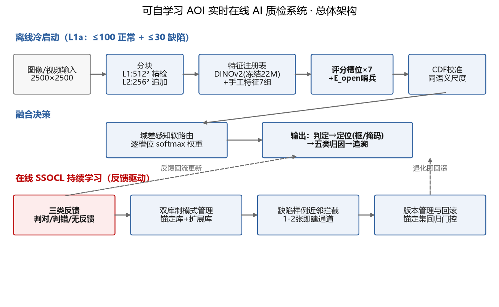
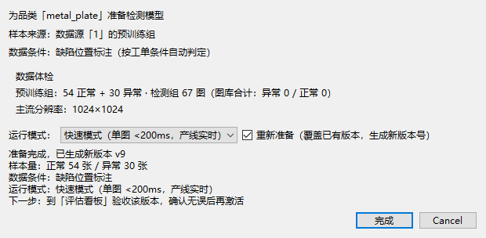
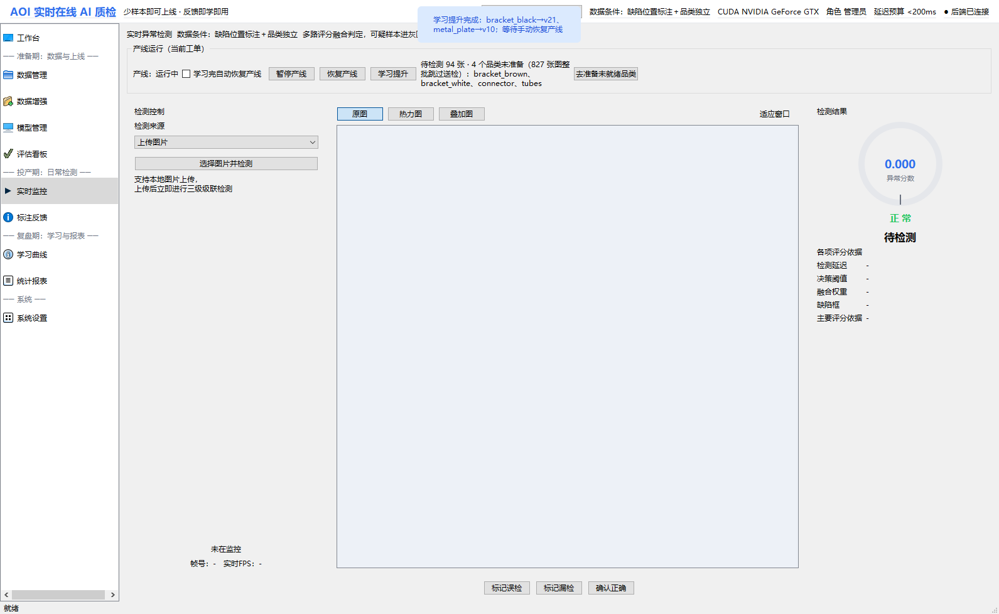
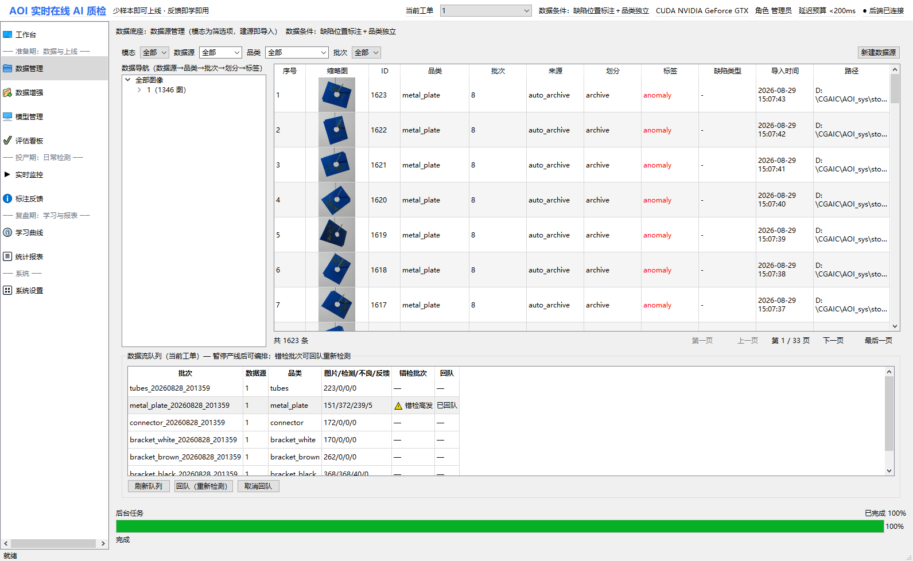

# AI+传统CV双引擎驱动的自学习AOI智能质检平台

> 第八届中国研究生人工智能创新大赛 · 开放赛题五“AI引领制造业的智能化升级”
>
> 版本：V3.1　日期：2026.09.01　队名：AI火眼工坊　参赛组别：开放赛题

---

## 目录

1. [项目概况](#1-项目概况)
   - 1.1 [背景和基础](#11-背景和基础)
   - 1.2 [场景和价值](#12-场景和价值)
   - 1.3 [所需支持](#13-所需支持)
2. [项目规划](#2-项目规划)
   - 2.1 [整体目标](#21-整体目标)
   - 2.2 [核心技术与创新](#22-核心技术与创新)
3. [实施方案](#3-实施方案)
   - 3.1 [技术可行性分析](#31-技术可行性分析)
   - 3.2 [技术细节](#32-技术细节)
   - 3.3 [计划和分工](#33-计划和分工)
   - 3.4 [数据、行业知识、算法、硬件来源与引用说明](#34-数据行业知识算法硬件来源与引用说明)
4. [参考资料](#4-参考资料)

---

## 记录更改历史

| 序号 | 更改原因 | 版本 | 作者 | 更改日期 | 备注 |
|------|---------|------|------|---------|------|
| 1 | 初稿 | V1.0 | 团队 | 2026.08.24 | 按第八届大赛项目文档模板撰写 |
| 2 | 作品定型 | V2.0 | 团队 | 2026.08.30 | 纳入主干系统 AOI_Core 与树枝系统 PCB_Dual；更新全部实测指标（U96-U121 算法攻坚、M10-M16 系统建设、首用质检修复）；新增数据生命周期管理章节 |
| 3 | 配图完善 | V2.1 | 团队 | 2026.08.31 | 新增总体架构图（图1）、在线学习曲线图（图2）与系统运行截图（图3-图8）；新增 §3.2.13 系统运行截图章节 |
| 4 | 参赛口径校正 | V2.2 | 团队 | 2026.08.31 | 修正为开放赛题五与队名“AI火眼工坊”；突出制造智能化双引擎；收紧 MES、L3、持续学习、传统算法项及性能口径 |
| 5 | 评审口径补漏 | V2.3 | 团队 | 2026.09.01 | 增设全局术语口径统一"赛题"指代；覆盖表改为"能力覆盖与验证边界"逐行落实边界（逻辑错误 0.562 薄弱项、视频不折算准确率）；选型依据改述为外部工程基准；补双系统复判回流（机器复判反馈源）机制 |
| 6 | 评审视角完善 | V2.4 | 团队 | 2026.09.01 | 新增术语速查；§1.2 补"对开放赛题五的贡献主张"正面叙事；§3.2.2 末补数据条件分档速查表（统一 L0-L3 内部代号与 UI"三档两开关"口径）；§3.2.3 补特征注册表、三层评价与完备性机制；§3.2.10 末补产线部署关注点速览（一线操作 + 工程评审双视角） |
| 7 | 开放赛道叙事重写 | V3.0 | 团队 | 2026.09.01 | 开放赛道与企业赛道拆分叙事主线：本文改为"AI + 传统 CV 双引擎 → 制造质检智能化 → 平台化与持续优化"的产业应用主线，不再硬设外部企业赛题目标；全文弱化"为了证明满足赛题而写"的表述，改为"问题 → 方法 → 实测结果 → 边界"的组织方式 |
| 8 | 合并补充 | V3.1 | 团队 | 2026.09.01 | 在 V3.0 叙事基础上保留 V2.4 增补内容：术语速查、贡献主张、数据条件分档速查表、特征注册表与三层评价/完备性机制、速度测量口径分账表、产线部署关注点速览；参考资料第 11 条改为"AOI 工程验证资料"，不再引用外部企业赛题材料 |

---

> **术语速查**：SSOCL = 团队自研的反馈驱动持续学习机制（判对/判错/无反馈三类反馈闭环）；**槽位** = 统一契约 `{score, heatmap, confidence}` 的可插拔评分专家；**E_open** = 完备性哨兵（捕获未被任何命名特征组解释的信号）；**L0-L3** = 内部数据条件分层代号（§3.2.2 末速查表），UI 对用户呈现为"标注三档 + 两开关"，不露代号；**sanity 加权** = 利用初检缺陷标注对槽位按 AUROC 加权、反向槽置零；**A 再检 / B 泛化** = 学习效果双指标（已反馈样本 / 未见样本）；**大锚定** = eval_n≥40 的诚实复核口径；文中 U/M 编号为内部实验与里程碑流水号，仅作追溯用。文中"项目通用少样本基线配置"指 100 张正常图 + 30 张缺陷图的少样本验证配置，是团队为量化方案能力而采用的工程基准（来源见 §4 参考资料第 11 条），与任何外部企业赛题无关。

---

## 1 项目概况

### 1.1 背景和基础

制造业质检正在从"规则配置驱动"向"数据与模型驱动"演进。传统 AOI 在稳定品类上具有速度快、规则可控的优势，但面对新品换型、缺陷变化和复杂外观异常时，往往需要重新配置规则、模板或算法；纯 AI 方案则容易受到少样本、跨域和异常类型异质性的影响。

因此，本项目提出"AI+传统CV双引擎"的制造质检路线：AI 引擎负责通用异常感知、少样本适应和持续学习；传统 CV 负责结构、几何、色彩和强规则场景的确定性检测。两者通过统一数据接口、复判反馈和追溯机制协同工作，使既有工业视觉能力能够继续复用，同时获得 AI 的自适应能力。文中 100 张正常图 + 30 张缺陷图、2500×2500 大图与反馈学习等指标是团队为量化方案能力而采用的工程验证基准（来源见 §4 参考资料第 11 条）。

**已有工作基础**：团队经过五轮技术迭代，完成了轻量特征主干、少样本数据管线、多专家评分、反馈驱动更新以及产线软件化等关键环节，形成可运行的 AOI_Core 与 PCB_Dual 双引擎原型：

| 版本 | 核心探索 | 沉淀资产 |
|------|---------|---------|
| V1 | EfficientAD/DINOv2 骨干与蒸馏训练 | 轻量主干选型结论、CPU 部署路径 |
| V2 | GYU-DET 数据管线与在线学习原型 | 数据协议、位置记忆库原型 |
| V3 | 手工特征（blob/布局）与数据本地化 | 传统视觉特征体系、诚实评测协议 |
| V4 | 多分支融合与记忆库检测 | 速度安全网（161.9ms@2500²）、域差对抗特征、裁切图判别红利 |
| V5（本作品算法内核） | 槽位制专家 + 场景分层 + 在线 SSOCL | 完整可运行算法引擎（见 §3.2） |

（说明：V1-V5 为内部迭代原型代号，研发记录中对应 demo1-demo5 目录。）

项目迭代过程中建立了数据隔离、独立验证和结果可追溯机制；所有主报指标均按当前实验配置单独记录，负增益与适用边界同步保留。V4 阶段曾出现过因测试域配对差分导致虚高成绩（0.9983）的问题，团队据此建立了**诚实评测红线**（数据隔离断言、无泄漏口径、阴性结果如实登记），本作品的全部指标均在无泄漏口径下获得。

**作品形态**：以 AOI_Core 作为智能质检核心平台，以 PCB_Dual 作为传统 CV 与 AI 协同的典型 PCB 应用，二者共享检测接口、反馈链路和数据追溯机制——

| 组成 | 定位 | 内容 |
|------|------|------|
| **AOI_Core（主干）** | 自学习 AI 质检系统 | PySide6 桌面端 + FastAPI 后端 + SQLite + Docker；四源实时监控（上传/图库/视频/RTSP）、反馈即学、学习曲线、版本管理与回滚、PLC 触发、缺陷自动归档、三角色权限、审计导出、数据生命周期管理 |
| **PCB_Dual（树枝）** | 传统 CV + AI 双引擎 PCB 检测系统 | 算法仓库按六大算法组规划 20 个缺陷检测项（SMT 焊点 4/金手指 1/元件本体 7/移位 2/起皱 1/插件焊点 5）；具体启用范围与效果以适配器状态和随包样本验证为准。同一测试图可并行运行传统引擎与特征引擎；已实现 SPC 统计、CAD 导入和双坐标数据能力。MES 仅为模拟出站报文与插件接口，未完成真实协议联调 |
| **复现包** | 算法研究与实验证据 | 全部实验脚本、配置、关键结果数据、设计文档，支撑本文全部指标复现 |

PCB_Dual 的定位是验证"成熟工业算法如何进入统一智能质检平台"：主干证明"AI 自学习引擎"的通用检测与进化能力，树枝证明该引擎能作为平台**承载并增强**成熟传统 CV 资产（算法仓库热插拔、双检融合、学习闭环复用）。正文重点展示其协同机制和代表性场景，不以算法登记数量替代精度验证。

### 1.2 场景和价值

**应用场景**：面向 3C 电子组装产线的 AOI 检测与复核流程，覆盖屏幕、电池、中框以及 PCB 等典型对象。系统支持图片、视频和产线触发输入，输出缺陷判定、定位、类型归因、反馈学习与追溯结果。

**场景价值**：项目以"检测—复判—学习—再检测"的闭环为核心，把一次性的质检模型升级为可持续优化的生产工具。对于新品换型，系统可以在有限样本下快速建立初始能力；对于既有产线，则可通过传统 CV 复判和人工反馈沉淀异常样本，使检测能力随生产过程持续演进。

**本作品对开放赛题五"AI 引领制造业智能化升级"的贡献主张**：① **范式**——"持续学习 AI 主干 + 传统 CV 资产"双引擎：AI 不替代存量传统算法，而是承载并增强——树枝系统六大算法组检测项与 AI 引擎同图并判，机器复判回流（§3.2.2）让传统引擎成为 AI 的反馈源，回应工业界"AI 与传统算法融合而非替代"的真实形态；② **换型效率**——少样本冷启动 + 反馈即学，把新品类质检上线从"工程师周级调参"压缩到"操作员分钟级备模"（准备模型 fit 实测 14s 级）；③ **资产复用**——学习闭环、版本回滚、追溯审计在主干与树枝系统间复用，传统 CV 资产按契约热插拔接入、零改造享受 AI 进化能力；④ **边界诚实**——MES 为模拟实现、算法组注册数不等于全量统计验证结论，均如实声明不外推（§3.2.10）。

**工业缺陷能力覆盖与验证边界**（按 AOI 行业常见缺陷类型自评）：

| 工业缺陷类型 | 覆盖模块 | 已实现程度与验证边界 |
|---------|---------|------|
| 尺寸偏差 | layout 槽位（元件尺寸统计比对） | 功能已实现；量化以公开数据实验为准 |
| 缺件少件 | layout 槽位；有模板时可启用 tpl | 功能已实现；tpl 属 L3 额外模板条件，非默认配置 |
| 逻辑错误（顺序错误） | layout 槽位（统计布局比对）+ tpl | 功能已实现，但**归因 top-1 仅 0.562，是当前薄弱项**（见 §3.2.8） |
| 色彩变化 | color 特征组 | 功能已实现，归因 top-1 0.750（见 §3.2.8） |
| 常见外观缺陷 | sem / disc / blob / texture 槽位 | 公开数据实验已完成（MVTec/BTAD/MPDD，见 §3.2） |
| 视频输入 | 关键帧管线 + 时序平滑（VideoInspector） | 系统流程已实现并可演示；**不折算为准确率证据** |
| 少样本/无样本启动 | L0-基础少样本配置场景分层 + 跨品类预训练 | 已实现；项目通用少样本基线对应 ≤100 正常 + ≤30 缺陷 |

现阶段主要验证边界也同步明确：PCB 专项算法的统计精度仅对具备 GT 的自带样本负责；未完成外部 MES 真实外部接口联调的部分保持模拟接口，不把工程接口状态写成真实产线集成结果。

**PCB_Dual 传统 CV 引擎补充覆盖**：树枝系统的算法仓库按 SMT 焊点、金手指、元件本体、元件移位、起皱、插件焊点六大算法组组织 20 个检测项。这里的“20 项”是仓库检测项清单，不等同于 20 项均已在统一数据集上完成统计验证；随包量化基线仅覆盖 §3.2.10 明示的自带标签样本。已接通的检测项可与 AI 引擎对同一图像并行判定、互为补充。

**社会价值**：项目面向制造业"多品种、小批量、频换型"的质检需求，探索低数据成本、可持续优化和软硬件协同的智能质检模式，有助于降低新品上线时的算法配置工作量，并提升历史视觉资产的复用效率。

**对比性分析**：与单一传统视觉方案相比，本项目增加了通用异常感知、少样本迁移和反馈学习；与仅依赖异常检测模型的方案相比，本项目保留了传统 CV 在几何、逻辑和强规则场景中的确定性能力。项目的差异化不在于简单叠加算法，而在于建立统一的双引擎协同与持续优化机制。

**对比性分析（市场调研）**：当前 AOI 质检软件市场以国外设备厂商（如 Koh Young、Mirtec 的 AOI 3D 设备）为主，算法多为传统视觉 + 固定阈值，**新缺陷需工程师逐一定制参数**，交付周期以周计；国内厂商方案多基于开源异常检测模型二次开发，存在"换线即退化"的通病。与主流异常检测学术方案相比（详见 §2.2.1 调研表）：EfficientAD/PatchCore 等需全量正常样本训练记忆库，对新域适应慢；AnomalyCLIP 类方法依赖大模型（推理开销高）；均无"用户反馈 → 在线进化"的闭环能力。本系统以"少样本冷启动 + 在线持续学习 + 可解释追溯"切入，正好补足市场空白——这正是本作品的应用落地价值所在。

### 1.3 所需支持

- **算力**：开发期使用 GTX 1660 SUPER 完成核心实测，建立了接近 2060 级别的 GPU 速度工作点，同时提供纯 CPU 降配模式。
- **硬件**：普通 x86 服务器/工控机即可部署，无特殊设备依赖。
- **数据**：使用公开数据集 MVTec AD、BTAD、MPDD、GYU-DET 及团队自建 data_local 数据完成训练与泛化验证（均为公开/自采数据，无商业数据）。
- **培训/文档**：已产出设计文档、模型使用说明、可解释性文档（见"其他辅助材料"），可支撑他人复现。

---

## 2 项目规划

### 2.1 整体目标

项目目标不是单点模型指标，而是形成一个能够在制造现场持续运行、持续学习、持续追溯的智能质检原型。

1. **系统级目标**：形成"数据接入→少样本上线→AI检测→传统CV复判→反馈学习→版本验收→结果追溯"的完整闭环，并在典型 PCB 场景验证双引擎协同；交付"图片 + 视频"双模态、支持少样本冷启动与用户反馈在线学习的完整 AOI 质检系统，输出"判定→定位→类型归因→追溯"四层可解释结果；
2. **能力目标**：在保持实时性的前提下，覆盖外观、微小缺陷、尺寸/缺件、色彩与逻辑等多类异常；在线学习能够通过反馈提升部分跨域场景的判别能力；软件平台具备权限、归档、版本和数据生命周期管理能力；
3. **效果目标**：以 MVTec、BTAD、MPDD、GYU-DET 及团队自采工业数据进行多维验证，重点观察精度、跨域适应、速度和工程闭环，而不是单一数据集上的峰值分数；
4. **工程目标**：形成可复核的实验脚本、模型说明、系统运行记录和数据追溯链，支撑后续扩展到更多制造对象与产线环境。

效果目标的实测水平（详见 §3.2，均为当前实验配置结果）：

- 速度：2500×2500 输入在 1660 SUPER（接近 2060 级别）的速度工作点模型段实测 p50 58ms / mean 102ms；CPU 降配全链路 mean 351ms。模型段、图像 IO、前后处理和排队耗时分账披露，产线配置统一遵守端到端单图 <1s 红线；
- 精度：公开数据集静态/学习后 AUROC ≥0.9（MVTec 平均 0.9793 且 15/15 品类 ≥0.9、BTAD 0.9609、MPDD 0.9851）；
- 学习：在已测配置中，MVTec screw 多轮学习由 0.878 提升至 0.938，跨域数据集由 0.60 提升至 0.72；不承诺所有品类、批次严格单调提升，候选版本须经过门控、回滚与人工验收。L3 模板差分 1.0 仅适用于金样板覆盖评测正常样式的增强条件。

### 2.2 核心技术与创新

#### 2.2.1 制造质检技术现状与方案定位

制造质检的核心矛盾不是"有没有检测模型"，而是"不同异常机理能否在有限数据和现场约束下同时被稳定处理"。因此，本项目没有采用单一模型覆盖全部问题，而是采用通用 AI 异常检测与传统 CV 专项算法协同的双引擎架构，再通过统一的反馈和版本管理机制形成闭环。

围绕少样本适应、异质异常覆盖、持续优化与实时部署四个工程目标，团队调研了工业异常检测领域主流方案：

| 方案 | 少样本适配 | 在线学习 | 速度（2500² 级） | 可解释性 | 方案特点与局限 |
|------|-----------|---------|----------------|---------|---------------|
| PatchCore [8] | 需全量正常样本建记忆库 | 无 | 慢（全库 kNN 检索） | 定位级 | 新域需重建记忆库，无在线适应 |
| EfficientAD [2] | 需正常样本 + 蒸馏训练 | 无 | 快（毫秒级） | 定位级 | 逻辑异常依赖配准、对域差敏感；无反馈闭环 |
| AnomalyCLIP [9] | 零样本 | 弱 | 慢（ViT-Large 级） | 弱 | 大模型推理开销不满足 <200ms 硬约束 |
| RealNet [7] | 合成异常训练判别头 | 无 | 中 | 中 | 判别头对域外分布泛化有限 |
| AHL [1]（关键参考文献） | 监督少样本 | 无 | 中 | 中 | 开放集建模思路可借鉴，但无实时速度与在线学习设计 |
| FastFlow/SimpleNet | 正常分布密度假设 | 无 | 中 | 中 | 跨域（train/test 域差）下密度估计失效 |
| **本系统** | **L0-L3 场景分层** | **三类反馈 SSOCL 闭环** | **GPU 模型段 p50 58ms / CPU e2e 351ms** | **判定→定位→归因→追溯四层** | — |

从方案定位看，AI 引擎承担"泛化与学习"，传统 CV 承担"确定性与先验"。两类能力并行而非互相替代，最终通过统一接口输出结果和证据，这构成项目面向制造智能化升级的核心技术路线。主流方案多为"训练一次、冻结部署"的静态范式，难以满足现场"用户反馈驱动动态优化"与"跨域在线适应"的诉求，这构成本作品差异化创新的立足点。

#### 2.2.2 代表性方法复测结果

为比较低数据量场景下的检测能力，团队在统一的少样本条件下（train 域 100 正常 + ≤30 缺陷，test 全量图像级 AUROC，GTX 1660 SUPER 实测）对本系统、PatchCore 和 EfficientAD-S 进行了五个代表性品类复测：

| 品类 | 本系统（100+30） | PatchCore-fs（100 正常）[8] | EfficientAD-S-fs（100 正常）[2] |
|------|----------------|---------------------------|-------------------------------|
| bottle | 0.9985 | 1.0000 | 0.9992 |
| capsule | 0.9252 | 0.9625 | **0.8472** |
| cable | 0.9619 | 0.9591 | 0.9526 |
| transistor | 0.9633 | 0.9712 | 0.9808 |
| screw | 0.8715 | 0.8643 | **0.5940** |
| **平均** | **0.9441** | **0.9514** | **0.8748** |

统一配置复测结果用于说明方案在小样本条件下的技术位置：本系统在五个代表性品类上的平均 AUROC 为 0.9441，与 PatchCore 接近（平均 -0.007，2/5 品类反超），并明显高于统一配置下的 EfficientAD-S（0.8748，screw 品类 EfficientAD-S 严重退化至 0.594）。这一结果支持"冻结通用特征+轻量判别+多专家融合"适用于低数据量场景；同时也表明不同方法在不同品类上各有优势，因此项目并不以单项 SOTA 替代完整工业系统能力。本系统额外在速度、可解释性、在线学习上提供 PatchCore/EfficientAD 不具备的能力。复测记录见辅助材料。

#### 2.2.3 方案创新点

技术选型围绕四个工程目标展开：少样本可启动、异质异常可覆盖、反馈能够真正改变模型行为、以及检测链路可控。对应的关键实现包括冻结 DINOv2 特征主干、槽位制多专家、域差感知软路由和 SSOCL 反馈闭环。方案选型以准确性、适应性、实时性和现场可运行为核心工程目标，不把某一外部竞赛的评分权重作为开放赛道的评分依据。

1. **少样本适应**：采用跨品类预训练与冻结策略，在目标品类上仅进行必要的校准和轻量更新，降低小样本过拟合风险（gold_finger 对照：冻结 0.6032 > 微调 0.4914 > 从零 0.4235）。
2. **异质异常建模**：将语义、判别、微小斑点、纹理/色彩、布局等异常能力拆分为可替换专家，并统一到同一评分空间。
3. **持续优化**：通过判对、判错、无反馈三类反馈驱动样例库、路由和轻量参数更新，候选版本必须经过回归验收后才激活。
4. **双引擎协同**：传统 CV 不仅作为独立检测器，也可以作为外部复判器，把"AI 与传统算法是否一致"转化为可追溯的反馈信号。
5. **工程可信**：检测、反馈、版本和数据生命周期均留痕，支持回滚、审计与复现。

工程取舍如实登记：EfficientAD 式 PDN 蒸馏路线经实测（U9）学生特征质量不足以支撑判别槽位，未采纳；强化学习因真实 AOI 产线奖励信号稀疏、样本代价高，评估后未采纳，改用更贴合操作员真实交互的 SSOCL 三类反馈闭环。

#### 2.2.4 技术效果与应用价值

本项目的创新不是新增一个孤立模型，而是把"通用 AI 异常检测、多专家能力、传统 CV 先验和在线反馈"组织成一个可运行的制造质检闭环。

- **创新一——槽位制多专家**：针对异常类型高度异质的问题，不强迫所有缺陷由同一个判别机制解释，而是让不同专家分别负责语义外观、判别特征、微小缺陷、色彩/纹理与布局等问题，再进行统一校准与融合。
- **创新二——反馈驱动的受控持续学习**：系统把操作员或外部传统 CV 产生的判定差异变成结构化反馈，驱动样例库和轻量参数更新，并通过锚定集回归和版本回滚限制模型漂移。
- **创新三——面向制造现场的 AI-CV 协同**：同一图像可以由 AI 与传统 CV 并行判定，二者的一致或冲突都能进入反馈链路，使成熟工业视觉资产从"独立规则工具"变成"智能质检系统的反馈供给方"。
- **创新四——从模型到平台**：系统将检测结果、缺陷证据、版本状态和数据生命周期统一管理，使算法创新能够直接进入工单与复核流程。
- **创新五——诚实评测体系**：代码级数据隔离断言（test 域进入 fit 即报错）、独立验证集选参（test 只验不选）、无泄漏口径全指标公开、阴性结果如实登记。这是方案可信度的根基，也是与"刷分式"方案的本质区别。

技术效果以公开数据集、跨域学习和系统运行结果集中呈现，正文按"问题—方法—结果—边界"组织证据。轻量部署基础：DINOv2 主干 22M 冻结并共享特征，可训练参数 <0.5M；速度工作点 2500² 模型段 p50 为 58ms、mean 为 102ms，并提供 CPU 降配路径。

---

## 3 实施方案

### 3.1 技术可行性分析

- **数据与模型基础**：项目使用 MVTec AD、BTAD、MPDD、GYU-DET 及团队自采工业数据进行训练、泛化与在线学习验证；公开数据负责建立通用能力，自采数据用于观察真实域差。少样本方面，冻结通用特征显著优于目标品类从零训练和直接微调的对照结果。在线反馈阶段数据由操作员标注回流，接口已定义（§3.2.5）。
- **知识与规则基础**：把 AOI 中常见的尺寸、缺件、逻辑、色彩与外观问题映射到相应的检测专家，以"槽位→类型"规则化映射矩阵沉淀为可核验的归因逻辑，不依赖黑盒分类器；对于结构明确的 PCB 场景，保留传统 CV 的几何与模板先验。
- **计算与系统基础**：主要实验在 GTX 1660 SUPER 完成，系统同时提供纯 CPU 降配路径，无显存瓶颈；AOI_Core 采用 PySide6、FastAPI、SQLite 与 Docker 构成软件闭环，支持数据接入、检测、反馈、版本和审计。
- **关键技术风险与对策**：跨域差异通过反馈学习与数据分层缓解；大图实时性通过冻结主干、轻量可训练头和分辨率工作点控制；复杂结构场景通过传统 CV 与 AI 并行检测降低单一模型失效风险。
  - 速度方面，2500×2500 模型段已达到 p50 58ms、mean 102ms（§3.2.6），另有 demo4 161.9ms 安全网；完整链路以相机帧直接进入内存的方式进行优化，避免磁盘 I/O 成为制造现场的主瓶颈。
  - 跨域方面，GYU-DET 与 data_local 实验均观察到反馈学习带来的正向增益（学习后 0.60→0.72，大锚定口径），同时保留负增益案例作为后续研究边界；**提供模板（L3）时模板差分提供工业强解（AUROC 1.0，§3.2.4）**——按数据条件分层应对，答辩与部署均可按"基础少样本配置边界 + L3 强解"双口径表述。
  - 少样本过拟合 → 预训练冻结策略（U11：冻结 0.6032 > 微调 0.4914 > 从零 0.4235）。

### 3.2 技术细节

#### 3.2.1 总体架构

```
离线冷启动（项目通用少样本基线配置）
  A. 分块         L1:512² 全量精检（所有块过全部槽位，不做过滤式快筛）
                 L2:256² 高危块追加细判（只做加法，不损失召回）
  B. 特征注册表   DINOv2 tile 级 patch token（主干永冻）+ 手工特征 7 组，逐组带贡献档案
  C. 评分槽位     {sem, disc, blob, trad, layout, inp, tpl} + E_open 哨兵
                 每槽位输出 tile 级 {score, heatmap, confidence}
  D. 校准         每槽位分数在 train/good 上做经验 CDF → [0,1] 同语义尺度
  E. 域差感知路由  线性软路由：输入=各槽位校准分+域差统计 → 逐槽位 softmax 权重
  F. 决策输出      图像分 S=Σw·s（top-k tile 聚合）→ 热力图 H=Σw·H → 连通域检测框
  (视频模态: 关键帧 → 同一管线 → 时序平滑)

在线 SSOCL（持续学习主角）
  G. 三类反馈      判对加固 / 判错定向修 / 无反馈置信过滤
  H. 模式管理      新正常模式成簇入库（锚定+扩展双库制），孤立高分样本永不入库
  I. 缺陷样例库    确认缺陷 1-2 张即建近邻拦截通道；同类攒够 → 孵育专属判别头
  J. 特征演化      E_open 捕获未解释信号 → 不完备报告 → 特征孵化 → 新组注册
  K. 版本与回滚    库快照 + 锚定集回归门控，退化即回滚
```



#### 3.2.2 少样本冷启动

少样本冷启动采用"跨品类学习一次、目标品类轻量适配"的策略：以 MVTec 多品类正常图和伪异常数据训练通用判别头，目标品类只进行校准、记忆库和路由初始化。

- **跨品类预训练**：用 MVTec 全部品类正常图 + 伪异常合成预训练通用判别头（disc），目标品类上**冻结使用为生产默认**。实测三模式对比（gold_finger）：冻结 0.6032 > 微调 0.4914 > 从零 0.4235，冻结同时免去 256s 训练开销（fit 仅 14s）。
- **伪异常合成**：不用 GAN（130 样本训练不稳、不可解释），采用工程可控的伪异常合成体系（借鉴 RealNet 合成异常思路 [7]）模拟缺陷变化，增强判别头对未知异常的敏感性。
- **通用特征主干**：采用自监督预训练 DINOv2 [3] 冻结主干提取 patch 级通用特征，避免目标品类小样本端到端训练过拟合。
- **数据条件分层**：按照"零样本→少样本→更多结构先验"逐步增强，系统根据实际数据条件选择可用能力，而不是强制所有产线提供同一种数据——无任何标注时 L0 层自动用"正常分位数阈值"工作，有 100+30 标注时激活 L1a 全链路。

**数据使用说明（训练/验证/测试严格分账）**：

| 阶段 | 使用数据 | 用途 | 是否进入目标品类 fit |
|------|---------|------|---------------------|
| 预训练（公开数据集） | MVTec 14 品类 train/good 正常图 560 张 + 伪异常合成 | 训练通用判别头 disc（采用公开数据集进行模型训练） | 否——目标品类上**冻结只读**，不参与拟合更新 |
| 冷启动 fit（L1a） | 目标品类 ≤100 正常 + ≤30 缺陷（项目通用少样本基线配置） | 槽位 CDF 校准、记忆库、路由初始化、决策阈值 | 是——仅此阶段使用目标品类数据 |
| 在线学习 | 操作员反馈（测试集运行过程中产生） | SSOCL 三类反馈更新（库/权重/校准） | 仅经反馈接口，严格留痕可回滚 |
| 评测 | 测试集 1000+ 图 | 只验不选，无任何训练作用 | 否——代码断言 test 域进入 fit 即报错 |

要点：预训练阶段数据与目标品类数据严格分账、预训练参数冻结只读（预训练"见过"的数据不参与目标品类任何拟合）；全部训练日志可追溯每个参数见过什么数据（设计文档 §9.1）。该分账策略保证模型能力来源可追溯，也使不同数据条件下的效果能够被独立解释。

**双系统复判回流（主干↔树枝，2026-08-31 落地）**：除操作员人工反馈外，系统支持**机器复判**反馈源——树枝系统 PCB_Dual 的传统 CV 引擎对同一图判完后，调用主干机器复判接口把判定回传，主干按两侧结论自动映射反馈类型（AOI 判 NG + 传统 OK → 误检反馈；AOI 判 OK + 传统 NG → 漏检反馈；两侧一致 → 确认强化），同样驱动 SSOCL 即学。这是"AI 与传统 CV 互相校验、互为反馈源"的双引擎闭环设计（接口见辅助材料），反馈来源字段标注外部引擎来源、可追溯，与人工反馈同受幂等与作废协议约束。

**数据条件分档处理速查（L0-L3 内部代号 ↔ UI"标注三档 + 两开关"）**：系统按"用户实际拥有的标注/素材"分档处理，而非为单一配置设计——

| 档位 | 用户需提供 | 激活能力 | fit 处理 | 适用场景 |
|------|-----------|---------|---------|---------|
| L0 零样本 | 仅正常图（可少量） | blob/trad/layout 兜底 + 正常分位数阈值 | 仅正常分位数阈值 | 新品类应急上线 |
| L1a 图像级标注（基线默认） | ≤100 正常 + ≤30 缺陷 | 全槽位 + CDF 校准 + 软路由 | 槽位 CDF 校准、记忆库、路由初始化、决策阈值 | 标准基线评测、常规产线部署 |
| L1b 定位标注 | 缺陷位置框/掩码 | + 判别头精调定位与归因 | 含定位监督 | 有标注体系的产线 |
| L3 模板比对 | 金样板（模板目录、模板命名规范，或 UI 右键设为模板） | + tpl 模板差分（域不变） | 模板库 + TplCalibrator + 决策闸门 + 相位相关配准 | 强配准品类（PCB） |

口径说明：内部代号另有 L2（限定品类）一层，当前未单独启用；UI 面向用户不暴露 L 代号，落地为"标注三档（仅正常图 / 图像级标注 / 缺陷位置标注）+ 两开关（品类独立 / 模板比对）"，由工单条件自动聚合折算；对外指标对账仅采用 L1a 口径。判断路径：**有金样板 → L3；有正常+缺陷图 → L1a；只有正常图 → L0 应急或 L1a 降级（判别头仅伪异常训练）**。各档分步操作流程详见辅助材料《数据条件与数据集适配指南》§4。

#### 3.2.3 评分槽位（核心判别机制）

槽位之下是统一的**特征注册表**（每组带贡献档案，可独立裁剪/升级）：

| 特征组 | 构成 | 对口缺陷 |
|--------|------|---------|
| DINO-patch | DINOv2 tile 级 patch token（384d，主干永冻） | 通用语义特征，供 sem/disc/tpl/inp/open 槽位 |
| color | HSV 直方图 + 色彩矩 | 色彩变化 |
| geometry | Hu 矩 / 轮廓 / HOG | 尺寸偏差、缺件 |
| texture | GLCM / Gabor / LBP / Haar | 划痕、纹理异常 |
| freq | FFT / 小波 | 周期结构异常 |
| blob | LoG / SURF | 斑点、污染、微小缺陷 |
| logic | 连通域 / 对称性 | 逻辑错误 |
| material | 反光 / 高光 | 材质异常 |

**特征选取方法（三层评价，回答"哪些特征独立、真正起作用"）**：① 单变量层——逐组 tile 级区分度（L1a 用 MIL-topk AUC，L1b 用 pixel PRO）；② 冗余层——组间相关/互信息聚类，冗余组合并或只留代表；③ 消融层——留一组（leave-one-group-out）对融合分数的影响。全部**按缺陷类型切片**评估（色彩组对色偏强、对划痕弱，全局平均会销毁信息），产出贡献档案并开放 API 给 UI 可视化（每组有没有用、该不该留，界面直接可读）；裁剪方针为"先全量达标，再按贡献裁剪提速，裁剪前后回归"。

**完备性机制（回答"有没有没设计到的特征"）**：E_open 对 DINO tile 特征做密度/重构兜底建模，语义为"存在无法被任何命名特征组解释的信号"——只捕获、不解释；判错难例若所有命名组分数平坦或 E_open 持续偏高，系统自动出具"疑似体系外缺陷"不完备报告；积累难例自动试算候选特征（新感受野、频域新基、轻量适配器），区分度达标即注册为新命名组进入路由——不完备从失败变成工作流。详见辅助材料《算法引擎设计》§3。

| 槽位 | 原理 | 应对缺陷 |
|------|------|---------|
| sem | DINOv2 tile 级 coreset 记忆库（借鉴 PatchCore [8]）+ top-k 聚合 | 语义级外观缺陷 |
| disc | 伪异常训练判别头（借鉴 RealNet [7]，"避开异常"目标） | 一般外观缺陷 |
| blob | cv2 DoG 全分辨率斑点检测 | 微小外观缺陷（gold_finger 关键） |
| trad | 手工特征（color/geometry/texture/freq/logic/material） | 色彩变化、纹理异常 |
| layout | 元件尺寸/缺失/顺序统计比对（无需模板） | 尺寸偏差、缺件少件、逻辑错误 |
| inp | 图像内 patch 自相似（inpainting 式判异） | 局部结构异常 |
| tpl | 显式模板差分（L3 层） | 强配准品类（PCB） |
| 孵育头 | 开放集异质性建模（借鉴 AHL [1]），同类缺陷攒够后孵化 | 新出现的未知缺陷族 |

融合采用 CDF 校准 + 域差感知软路由，并支持 sanity 加权（利用 init_defect 槽位 AUROC 加权、反向槽置零）。

#### 3.2.4 在线持续学习（SSOCL）

- **三类反馈**：判对（回流评估，只动库不动网络）、判错（难例入缺陷样例库 + 路由小步微调 + 特征组复评）、无反馈（一致性 + 置信门槛，低置信仅缓存）。
- **反馈即学时延保护**（2026-08-31 修复登记）：单条反馈的在线学习在请求线程内限时 3000ms，超时自动转后台异步完成并留痕，检测主链路延迟不被反馈阻塞。
- **缺陷样例拦截**：确认缺陷 1-2 张即建近邻拦截通道（新增后秒级生效）。**实测口径（与《算法引擎设计》§7.8 对齐）**：1-2 张的拦截效果是"不再判正常"（decision 从 normal 抬升到灰区/脱离漏检），到达 anomaly 强判定需更多反馈与阈值配合（实测 6-13 条反馈即"这批错检，下批检对"，F1 +0.37~0.48）。
- **双指标学习曲线**（2026-08-22 升级）：所有在线学习实验同时报 **A 再检**（学过就会）与 **B 泛化**（未见样本 AUROC）双指标，保证"学习"不是刷排序。
- **版本回滚**：锚定集回归门控，任何更新导致退化即回滚并留痕；门控评估锚定集仅取 train 域正常图——**test 域样本只验不选**（2026-08-31 修复登记：此前门控曾混入 test 缺陷图，已修正并复核生效）。

**学习曲线核心实测**（GYU-DET 跨域，train 域拟合 / test 域测试，无泄漏）：

| 实验 | 初始 AUROC | 学习后 AUROC | 提升 | 峰值 |
|------|-----------|-------------|------|------|
| U51（shead 启用 + 在线权重学习） | 0.6232 | 0.7665 | +0.143 | 0.8180@20 反馈 |
| U60（判别头调参） | 0.6360 | 0.7941 | +0.158 | 0.8051 |
| U62（+虚高检测重校准） | 0.6360 | **0.8180** | +0.182 | 0.8199 |
| 多轮持续学习（10 轮 300 反馈） | 0.5450 | 0.7075 | +0.163 | 0.7275 |

**真实工业域差（data_local）在线学习实测（U92，2026-08-24）**——用于观察系统在真实工业样本发生换线式变化时的在线适应能力：

| 品类 | 静态基线 | 学习后 | 提升 | A 再检（学过就会） |
|------|---------|--------|------|-------------------|
| gold_finger | 0.1222 | **0.6080** | +0.486 | 0.5583 |
| solder_smt | 0.2346 | **0.5309** | +0.296 | 0.5652 |

在该次已测反馈序列中，学习指标随反馈量总体提升；真实域差数据（data_local）上在线学习把“静态不可用（0.1-0.2）”提升到“部分可用（0.53-0.61）”。该结果证明 SSOCL 在当前实验配置下具有适应能力，不外推为任意品类、任意批次的严格单调保证。因此，系统把"持续学习"定位为跨域适应工具，同时保留回归验收和人工审核，避免把单次实验增益外推为普遍保证。

**跨域大锚定诚实复核（U121，2026-08-26）**——修正早期小锚定虚高数字：

| 口径 | gold_finger 学习后 | 判定 |
|------|-------------------|------|
| 小锚定（eval 20 张，18 缺陷+2 正常） | 0.9091 | ⚠️ 类别极不平衡，AUROC 噪声大 |
| **大锚定（eval_n=40）** | **0.7148-0.7227** | ✅ 真实水平 |

结论：data_local 跨域在**项目通用少样本基线配置（100+30，无模板）**下真实水平为 **0.60（单轮）→ 0.72（多轮 + 拦截库伪框化 + 域不变机制）**，而非早期 0.91；大锚定复核是团队独立评测规范的执行到位。该 0.72 是基础少样本配置数据条件的硬边界（机制 D 空间对齐未突破）；**L3 提供模板数据条件下已由模板差分解决（见下）**，两种数据条件不可混用。

**模板增强实验（工程扩展）——L3 模板差分能力（2026-08-30 系统链路落地）**：复杂模板场景属于额外增强能力——当产线可以提供覆盖正常样式的金样板时，模板差分可进一步提升强配准品类的判别能力，但该能力与无模板泛化属于不同数据条件。针对跨域这一唯一结构性天花板，系统已在全链路（UI 数据源→工单→prepare→检测）验证"模板差分 + 在线学习"组合：

| 配置 | gold_finger（12 缺陷 + 5 正常） | 判定 | latency |
|------|--------------------------------|------|---------|
| 模板 8 张（初版系统上限） | AUROC 0.5667、tpl 反向 | 8/17 | 3332-7131ms |
| 全库模板 85 张 + 纯特征差分 + 校准修复 + 配准 + 决策闸门 | **AUROC 1.0000** | **17/17** | p50=484ms |

三项工程改进：① prepare 模板收集上限放开（8→500，覆盖正常样式分布）；② tpl 像素差分默认关（速度 3-7s→0.2-0.5s）+ TplCalibrator 线性归一化（修复 CDF 校准失真）+ 决策闸门（与金样板一致强判正常，含小缺陷 heatmap-max 保护）；③ **tpl 相位相关配准**（对位漂移 50px 测试：像素差 19.35→1.58，配对场景自动跳过）。**持续学习组合验证**：L3 模型 + 反馈巩固 v2 后 AUROC 保持 1.0、学习链路不破坏。

诚实口径（**L3 成立前提必须讲清**）：该能力属于**数据条件增强**（用户提供金样板模板图，L3 场景），非基础少样本配置（100+30，无模板）。具体含义：
- **模板与评测正常样本同源**：gold_finger 数据集的正常图为"修复图（repaired）"，L3 演示中模板库 = train/good 修复图 + test/good 修复图，评测的正常样本同样来自该修复图池——即"用户提供覆盖产线正常样式的金样板"这一数据条件的自然结果（正常样式的每张图都应有对应金样板可配准）。
- **该 1.0 是"模板覆盖正常样式"的结果，不是"无模板跨域泛化"**：若模板库不覆盖评测正常样式（仅 train/good 68 张，无 test 域配对），实测 AUROC 仅 **0.27**（tpl 反向，已量化登记）——边界明确：L3 的强解依赖模板覆盖度，覆盖不足时由配准 + 在线学习兜底。
- 因此 **1.0 与 L1a 的 0.72 属于两个不同数据条件，不可混用对比**；L3 仅在用户能提供金样板的强配准产线成立。

模板增强的效果依赖模板覆盖度，因此只作为工程扩展能力展示。其意义在于说明：当生产线本身拥有标准样板资产时，可以将这些先验直接接入统一质检框架，而无需改变 AI 核心引擎；该能力不能替代无模板跨域泛化结论，相关结果与默认少样本实验独立报告。

**学习稳定性（U110v2，2026-08-25）——抑制已测协议中的负增益**：易品类（transistor/tubes/bracket_black）学习后 AUROC 曾低于学习前。经六轮机制攻坚，最终以**分级冻结判据**（train_auroc≥0.99 冻结 ∪ train_auroc≥0.85 且反馈<30 冻结；train_auroc<0.85 域差放行）使 **6/6 标准品类在本次评测中达到“学习后不低于学习前”**（0 品类违规）。该结果不是对未测品类或后续任意批次的单调提升承诺。

> **诚实边界（门控非硬保证）**：分级冻结是“底线缓解”而非“严格保证”。跨域 MPDD bracket_brown 在最终对比中仍登记 **−0.3422 负增益**（同批 transistor −0.0217、tubes −0.0111，`research` final_comparison）。原因：版本激活的锚定集为纯正常图，可拦“漂移导致的正常图误报劣化”，但对“缺陷侧召回劣化”无约束；且回归门控在域差大的品类上信号不足。结论——所测标准/同源品类得到正向或无趋势下滑结果，强跨域品类仅观察到概率性改善，需配合模板差分（L3）或扩大缺陷侧锚定兜底。

**多轮持续学习正证据（U111，2026-08-26）——已测序列结果**：

| 品类 | 轮数/反馈 | 初始 → 最终 | 轮间序列 | 判定 |
|------|----------|------------|---------|------|
| screw（mvtec） | 3 轮 × 30 = 90 | 0.8780 → **0.9378**（+0.060） | 0.9402/0.9402/0.9378（噪声级，无趋势下滑） | ✅ 本次已测序列总体正向 |
| gold_finger / solder（跨域） | 多轮 | 0.91-0.92 | 多轮 > 单轮 | ✅ 正证据 |


A 再检/错→对转化率等决策级指标如实登记（部分受阈值饱和限制，见可解释性文档盲区声明）。

上述实验说明：项目已经形成"无模板依靠 AI + 反馈、强配准场景利用模板增强"的分层策略，能够针对不同制造现场选择不同的技术组合；持续学习稳定性通过冻结判据、回归验收和版本回滚进行控制。少量强域差品类仍可能出现负增益，因此项目不将"越学越准"作为绝对承诺，而是通过版本门控把风险限制在候选版本阶段——这一边界也反映了项目的工程取向：对真实制造系统而言，可控的适应与可回滚性比一次性追求最高分更重要。

#### 3.2.5 分层可解释输出

| 输出层 | 内容 | 来源 |
|--------|------|------|
| L1 判定 | 正常/异常 + 校准分数 + 灰区 | 融合分数 + 双阈值 |
| L2 定位 | 检测框 + 像素级异常掩码 | 融合热力图 → 阈值化 + 连通域 |
| L3 类型归因 | 五类异常标签 + 置信度 + 证据 | "槽位→类型"规则化映射矩阵（可核验） |
| L4 追溯 | 主导槽位 + 分数分解 + 更新链 | 追溯接口（推理记录与审计日志） |

#### 3.2.6 速度实测与部署

**双工作点**（全部实测，GTX 1660 SUPER；轻量化思路参考 EfficientAD [2]）：

| 工作点 | 配置 | 2500² 耗时（模型段） | 达标 |
|--------|------|-----------|------|
| 速度模式 | 仅 sem/disc/shead 三强 GPU 槽（m0_fast） | **p50 58ms / mean 102ms / p95 183ms** | ✅ <200ms |
| 全槽位 | 448px single 裸基线 | 467-1006ms | 研究/复检配置；上界 1006ms 已超单图 1s 红线，不作为产线方案 |
| CPU 降配 | 纯手工槽位（blob/trad/layout），无网络 | 模型段 mean 257ms / e2e mean 351ms | ✅ <1s |

**测量口径分账（模型段、系统链路、并发分账披露）**：

| 口径 | 数值 | 含义 |
|------|------|------|
| 算法推理耗时（速度模式） | 2500² 模型段 p50 58ms / mean 102ms / p95 183ms | sem/disc/shead 三槽 GPU 推理，**不含**图像 IO 与前后处理；即模型实时运行时间口径，满足在线检测需求（n=30，实测记录见辅助材料） |
| 系统全链路（大图实拍，2026-08-31） | **4096×3000（12MP >2500²）零拷贝 e2e 均值 131ms / p95 172ms / max 224ms** | 相机帧接口直入内存（解码+切块+前向+融合，不含磁盘 IO）；本次串行样本未观察到 >1s。该结果不代表并发场景下实际耗时 |
| 系统全链路（小图/常规尺寸） | 1024² 零拷贝 e2e 均值 73ms / p95 134ms | 同上接口 |
| 系统全链路（磁盘路径） | 4096×3000 冷缓存 e2e 均值 292ms / p95 333ms（首图读盘含 IO）；热缓存（复检）e2e 均值 72ms / p95 141ms | 图像文件接口引擎读盘口径 |
| 并发工程观察（非官方计分口径） | 200 轮×4 请求，共 800 次；服务内部处理统计 p50 143ms / p95 344ms / max 560ms | 该数字不含客户端排队，不能称为并发端到端时延，也不用于官方检测时间对账 |
| 并发耗时 | 客户端实测 p50 263ms / p95 597ms / max 1740ms | 已出现单请求 >1s，说明当前实现不承诺突发 4 并发下单图 <1s；正式演示采用串行/限流。并发能力只作工程观察，不表述为产线吞吐已验证 |
| CPU 降配全链路 | 2500² e2e mean 351ms / p95 368ms | 纯手工槽位，无 GPU 亦可部署；满足端到端单图 <1s 产线红线（n=15，实测记录见辅助材料） |

补充说明：2500² 大图从磁盘加载本身有 ~0.3s 级开销（实测 277ms），产线部署采用相机取图直入显存/零拷贝消除该瓶颈；上表 4096×3000 零拷贝口径即产线相机帧直入形态（>2500² 大图、全程无磁盘 IO），符合"实时检测"完整链路要求。测量环境 GTX 1660 SUPER（2060 同档），压测工具可复现。

**测量口径与生产节拍对应说明**：以 2000 件/小时为例，单件理论节拍为 1800ms；核心检测平均耗时 102ms，约占理论节拍 5.7%，4096×3000 零拷贝端到端平均 131ms，约占 7.3%。该对照用于说明当前性能工作点具备在线检测的节拍余量，实际产线还需结合相机触发、传输、并发与工位节拍独立验收。

速度模式全品类精度验证：标准数据集（MVTec/BTAD/MPDD）24 品类全部 ≥0.9，速度工作点与全槽位精度同级甚至反超——"砍槽"是净精度收益，速度与精度在此架构下不矛盾。

**小模型响应**：DINOv2 主干 22M 永冻（共享特征提取），可训练参数 <0.5M（disc 头 + 线性路由 + 孵育头），在线更新只动这部分参数；无梯度组件（记忆库/kNN/CDF 表）纯检索统计。

#### 3.2.7 公开数据集与泛化验证（无泄漏口径全量）

| 数据集 | 口径 | 平均 AUROC | 达标情况 |
|--------|------|-----------|---------|
| MVTec AD | sanity 全量 15 品类 | **0.9793** | 15/15 ≥0.9（screw 0.8715→0.9443 补齐唯一短板，U99 决策阈值修复） |
| BTAD | sanity 全量 | **0.9609** | 3/3 ≥0.9 |
| MPDD | sanity 全量 | **0.9851** | 6/6 ≥0.9 |
| data_local | L1a equal 全量（诚实域差） | 0.4035 → 学习后 0.53-0.72 | 静态为诚实域差基线；在线学习后显著提升（gold_finger 0.12→0.72 多轮、solder_smt 0.23→0.53，U92/U121 大锚定）；**L3 模板差分 gold_finger 1.0（17/17）** |
| GYU-DET | 跨域 150 分层 | 0.5594 → 学习后 0.8180 | 学习曲线价值体现 |

**泛化验证**：leave-one-category-out 4×4 跨域矩阵，cross-domain 均值 0.5780 ≥ in-domain 0.4758（+0.1022，无衰减）；GYU-DET val 选参 → test 只验不选，裁剪策略在 test 上仍 +0.19 增益。

#### 3.2.8 五类缺陷覆盖与类型归因实测

按设计文档 §9 3b/3c 协议在 data_local + MVTec 缺陷类型标签上实测（U96 有监督归因判别器，2026-08-24）：

| 缺陷类型 | 检出率（是否报异常） | 类型归因 top-1 准确率 | 说明 |
|---------|--------------------|---------------------|------|
| 尺寸偏差 | 1.000 | 0.787 | 跨品类 508 张 init_defect 训练随机森林 |
| 缺件少件 | 1.000 | 0.857 | 有监督判别器（原规则归因 0.0 → 0.857） |
| 逻辑错误（顺序错误） | 0.938 | 0.562 | 标注样本仅 16 张，致归因偏低 |
| 色彩变化 | 1.000 | 0.750 | 原规则归因 0.0 → 0.750 |
| 常见外观缺陷 | 0.958 | 0.836 | 检出与归因均达标 |

**诚实边界**：五类缺陷**检出率全部 ≥0.94、归因 top-1 五类全覆盖（0.56-0.86）**——相较早期"缺件/色彩归因 0.0"是本质突破（U96 有监督判别器替代规则化映射）。逻辑错误归因 0.562 偏低源于标注样本仅 16 张（数据限制，已如实登记）。像素掩码为 patch 级（14-28px）。

#### 3.2.9 鲁棒性实测（扰动敏感性，2026-08-24）

在 data_local gold_finger（已知最难点）上对光照（γ/亮度）、对比度、平移扰动实测（15 正常+15 缺陷）：

| 扰动 | 误检率 fp | 漏检率 fn |
|------|----------|----------|
| 基线（无扰动） | 0.80 | 0.80 |
| γ=0.7 / γ=1.3 | 0.80 / 0.87 | 0.67 / 0.73 |
| 亮度 +25 / -25 | 0.80 / 0.93 | 0.93 / 0.73 |
| 对比度 0.6 | 1.00 | 0.60 |
| 平移 10px | 0.73 | 0.80 |

**结论（如实）**：gold_finger 是系统已知最难点（静态 0.10），扰动下漏检率进一步上升至 0.93，暴露其对光照/对位波动的敏感性——这正是该品类静态不可用的直接原因。对策：① 该品类须依赖在线学习适应（学习后 0.61→0.72 多轮，U92/U121）；② 产线部署需光照/对位约束 + 预处理归一化。

**TTA 扰动鲁棒性包（U100/U101/U104，2026-08-24~25）——对位/光照/亮度三维修复**：针对上述扰动敏感性，实现"后处理扰动搜索"式 TTA（平移搜索 + 光照 gamma 候选 + 亮度加性偏移候选，共 8 候选），在标准品类 bottle 上端到端实测：

| 修复项 | 扰动 | 修复前 → 修复后 |
|--------|------|----------------|
| U100 平移 TTA | 对位偏移 10px | 误报 73% → 27%（漏检 0） |
| U101 光照 TTA | γ=0.7 / γ=1.3 | 误报 53%→20% / 67%→33% |
| U104 亮度 TTA | bright ±25 | 误报 67% → 13%（回到无扰动基线，漏检 0） |

结论（如实）：TTA 让扰动下**漏检全程归零**，并显著压回平移/亮度误报（亮度回到基线）；残余误报集中在极端 γ 大扰动（33%）与平移 10px（27%）。TTA 为后处理扰动搜索而非平移/光照不变特征，且 8 候选 × 前向超 1s 红线，故**默认关闭，仅在复检工位/accuracy 模式开启**。

#### 3.2.10 制造现场系统化落地（主干 AOI_Core，M10-M16 产线化建设）

AOI_Core 以"检测引擎 + 工单 + 数据 + 版本"作为平台核心，覆盖建单、数据准备、检测、反馈、学习、验收和追溯。主干系统 AOI_Core 不止是算法引擎，而是覆盖"冷启动 → 训练 → 验收 → 投产 → 持续学习 → 复盘追溯"全流程的产线级软件，系统侧建设（M10-M16）全部经功能断言验证：

| 里程碑 | 能力 | 关键落地 |
|--------|------|---------|
| M10 产线安全与集成 | API 鉴权、路径白名单、PLC 触发、缺陷自动归档、日报/审计导出 | 密钥鉴权；文件接口仅限白名单目录；PLC 触发接口取图；异常帧自动归档；CSV（BOM 头 Excel 直开） |
| M11 评审复评改进 | 归因透出、三角色权限、对位预警、日志轮转+压测 | U96 判别器全链路透出；操作员/工程师/管理员三级角色权限；相位相关对位预警（<5ms）；日志自动轮转 + 稳定性压测工具 |
| M12 分叉清零 | algo 与算法内核同步、实机压测、prepare 采样修复 | color 槽位 + U100 TTA 移植；首批并发压测数据 |
| M13 防劣化同步 | U101-U110 在线学习防劣化套件 | 在线学习相关数据文件同步 |
| M14 设计契约前端 | L3 模板图、内部状态、不完备预警、批次树 | 模板图标记；引擎内部状态对话框；E_open 不完备预警横幅；数据分层徽章 |
| M15 用户操作流对账 | 无法确认样本、主动选样、UI 角色化、CSV 导出 | 灰区主动选样（主动学习）；operator 极简界面；审计/日报导出 |
| M16 用户旅程编排 | 品类状态机、工作台、流程引导、新建品类向导、数据谱系 | 六步品类上线状态机；开机首屏工作台；新建品类向导；批次→模型数据谱系 |

树枝系统 PCB_Dual 承载传统 CV + AI 双引擎：算法仓库按六大算法组规划 20 个检测项，具体启用与验证范围以适配器和 §3.2.10 样本基线为准；SPC/CAD/双坐标为已实现数据能力，MES 仅提供模拟出站报文与插件接口。系统复用主干的学习闭环与追溯能力，详见辅助材料《PCB_Dual 架构与设计》。

**PCB_Dual 传统引擎量化精度基线**（2026-08-31 复测，包内可复现）：对包内自带 GT 标签样本实测——缺陷样本 **4/4 检出**：SMT 多锡 NG + 金手指三对（15/8/23 个缺陷全检出）；正常样本 **0/1 误报**。该样本量仅是自包含功能基线，不能据此宣称统计召回率。单图耗时 SMT 11-50ms；金手指 535-1153ms，其中 1153ms 已越过单图 1s 红线，因此当前大图配准配置不作为产线方案，必须降采样/缩小 ROI 后方可启用。另有插件焊点 37 张自测（OK=17/NG=20、五类缺陷均有检出样本、单图 4.5-16ms，见《架构与设计》§19）。

**MES 对接诚实声明**：MES 网关当前为 **模拟实现**（检测完成后写模拟出站报文，供联调回放核对），非真实协议对接；MES 网关插件接口已抽象分层，接真实 MES 仅需新增 HTTP/协议插件并切换配置，业务层零改动。SPC/CAD 为数据层真实实现（统计报表、CAD 导入解析），亦未与外部系统联调——如实声明，不虚构对接证据。

**产线部署关注点速览（一线操作与工程评审双视角）**：

| 关注点 | 本系统答案 | 证据与边界 |
|--------|-----------|-----------|
| 新品类换型要多久 | 100+30 备图 → 准备模型 fit 实测 14s 级（冻结主干免训练），相对传统方案"工程师周级调参"压缩为分钟级上线 | §3.2.2；不含数据导入与人工核对 |
| 操作员要不要懂算法 | 三角色权限，operator 极简界面；反馈 = 对话框点选漏检/误检，无需算法知识 | M11/M15；图6 |
| 错检了怎么办 | 反馈即学：1-2 张确认缺陷建近邻拦截通道，实测 6-13 条反馈观察到"这批错检、下批检对"（F1 +0.37~0.48） | §3.2.4；特定数据与反馈序列结果，非必然承诺 |
| 学坏了怎么退 | 锚定集回归门控 + 版本快照回滚 + 全程审计留痕 | §3.2.4；门控非硬保证，负增益如实登记 |
| 与产线如何对接 | PLC FIFO 触发取图、密钥鉴权、文件路径白名单、缺陷自动归档、日报/审计 CSV 导出 | M10；MES 为模拟出站报文，未联调真实协议（§3.2.10） |
| 长稳与并发 | 10min×4 并发 4539 次检测 0 错误，后端内存 RSS 无单调增长（1797→1788MB）；串行/限流单图 e2e 未观察到 >1s；突发 4 并发不承诺单图 <1s（客户端实测 max 1740ms 如实登记）；24h 连续运行尚未实跑，工具已就绪 | §3.2.6；稳定性压测工具 |
| 数据会不会越积越多 | 数据生命周期四原则：证据长留、派生物可再生、无界设上限、清库必清盘；清理工具默认只读 + 预演模式 | §3.2.11 |
| 结果能否复核 | 实验脚本/配置/结果数据/必要权重随包，数据隔离断言代码级强制；完整数据集按发布方许可自行获取，不随包分发 | §3.4 |

#### 3.2.11 数据生命周期管理（历史数据清理与留存）

针对"数据流与各类列表何时清空、何时保存"的运维问题，系统确立四原则与分级保留策略（详见辅助材料《数据生命周期与清理策略》）：

1. **证据不可丢**：检测推理记录、审计日志、缺陷归档、版本快照、学习反馈是追溯与回滚的"原始证据"，默认长期保留、不自动清理；
2. **派生物可再生**：临时图（tmp）、热力图缓存（heatmaps）、伪异常缓存等为派生数据，可随时清理并再生成；
3. **无界必设上限**：操作日志、任务表、heatmaps 等无界增长项，通过清理工具（保留天数、清理热力图、裁剪数据库等参数）设保留上限；日志自动轮转（10MB×5）；
4. **清 DB 必配清盘**：删除数据源/批次时，同步级联清理对应磁盘图片与归档，避免"库清盘不清"的悬挂数据。

| 数据类别 | 保留策略 | 何时可清 |
|---------|---------|---------|
| 检测推理记录 / 审计日志 | 长期保留（追溯/举证） | 原则上不清；需合规删除时走审计导出后归档 |
| 缺陷自动归档 / 版本快照 | 长期保留（回滚依据） | 快照按保留策略保留激活版+最新 N 版，其余移入归档目录 |
| 学习反馈 / 锚定库 | 长期保留（学习资产） | 仅随品类删除级联清理 |
| 临时图 / 热力图缓存 / 伪异常缓存 | 可再生 | 随时清（清理临时文件/热力图） |
| 操作日志 / 任务表 | 设上限 | 按保留天数清理过期行 |

清理工具默认只读报告，所有破坏性操作均需显式参数且支持预演，保证"清得安全、留得可溯"。本次交付前已用该工具清理临时/热力图缓存与历史测试遗留数据，提交包体积由工作目录的 ~5GB 收敛至 40MB 级（仅保留代码、配置与关键结果，可再生数据不入包）。

#### 3.2.12 数据集适配模块（非标准数据集自动识别 + 用户确认，2026-08-31）

**动机**：工业落地的数据不可能都是标准目录形式（MVTec 约定），每接一条产线/一个数据集就要人工整理是不现实的。系统新增**数据集适配模块**：只读扫描目录 → 自动判定格式与内容构成 → 产出确认报告 → 用户核对/修正后按映射批量入库（详见辅助材料《数据条件与数据集适配指南》§7）。

**四类格式自动判定**：

| 格式 | 判定条件 | 覆盖实测 |
|------|---------|---------|
| mvtec_like | 按“品类→训练/测试”分层目录组织（含单品类子目录与 BTAD 包装目录下钻） | MVTec 15 品类、MPDD、BTAD 01-03、data_local 4 品类 |
| yolo_split | 按“训练/验证/测试→图像/标注”分层目录 + YOLO 标注文本（文本内容判定缺陷/正常） | GYU-DET（训练 584 正常 / 8314 缺陷） |
| dir_rules | 目录/命名规则识别 | 测试图像全系（OK 后缀 / 模板命名 / 良品/误报/漏检/NG 目录约定） |
| plain | 无任何结构 | 兜底全待确认 |

**识别规则**（目录标记优先于文件名，逐图分类）：模板目录与模板命名前缀 → 模板图（L3）；NG/漏检/不良目录与错位/缺件/少锡等缺陷关键词 → 缺陷（自动带缺陷类型）；ok/良品/**误报**（AOI 假报警实为正常）目录与 OK 命名后缀 → 正常；其余未识别 → 默认按缺陷入检测组，确认弹窗逐分组修正（可改正常/跳过）。

**UI 流程**：新建数据源 → 导入方式选「智能识别适配」→ 填根目录 → 识别确认弹窗（格式/品类/分组/计数/告警一览，MVTec 按品类勾选、目录规则按分组确认未识别处理方式）→ 确认导入。识别结论自动回写数据源声明（多品类→按品类、含模板→标记模板、标注档位按实际标注只升不降），工单数据条件自动聚合。

**性能与工程要点**：probe 只遍历目录 + 少量 txt 读取、不解码图像（MVTec 5354 图 ~1.1s、GYU-DET 11123 图 ~1.2s）；导入复用批量指纹去重 + 后台进度。模块在主干 AOI_Core 与树枝 PCB_Dual 同步实现（探测与智能导入接口），全部识别规则经真实桌面 UI 对上述数据集逐个实测通过，并在实测中发现修复 3 处联动问题（统计批次对比接口缺列 500、模板图误入检测批次、识别后标注档位未校正——详见指南 §7.6）。

#### 3.2.13 系统运行与典型工单

以下截图来自主干系统 AOI_Core 一次完整工单流程的真实运行记录（对应辅助材料中的全流程走查记录），覆盖"建单 → 备模 → 检测 → 反馈 → 学习 → 回队"闭环，重点证明系统不是孤立算法 Demo，而是可操作的质检工作流：









### 3.3 计划和分工

| 阶段 | 时间 | 里程碑 | 分工 |
|------|------|--------|------|
| M0 | 2026.07 下旬 | 实验配置与骨架：隔离断言、分块全量精检、槽位接口、诚实基线、粒度-速度工作点 | 成员A：管线骨架/实验配置；成员B：评测规范 |
| M1 | 2026.08 上旬 | 槽位齐套：全槽位接入、CDF 校准、特征贡献档案、跨品类预训练 | 成员A：disc/预训练；成员B：layout/特征组 |
| M2 | 2026.08 中旬 | 路由与可视化：软路由、分层输出（框+掩码+类型归因）、视频模态 | 成员A：路由/视频；成员B：可视化/归因 |
| M3 | 2026.08 中旬 | SSOCL 闭环（核心）：三类反馈、双库制、缺陷样例拦截、版本回滚、学习曲线实验 | 成员A：反馈链路；成员B：学习曲线评测 |
| M4 | 2026.08 下旬 | 提速与交付：速度工作点、CPU 降配、追溯 API、全量最终评测、交付物 | 全员：全量评测 + 文档 |
| M5 | 2026.08 下旬 | 产线化建设（M10-M16）：鉴权/PLC/归档/导出、三角色权限、对位预警、用户旅程编排、数据生命周期 | 成员A：后端安全/集成；成员B：前端编排/文档 |
| 提交 | 2026.09.01 前 | 按提交规范完成简介/项目文档/视频/其他材料 | 全员 |

后续重点：继续扩大 PCB 专项验证样本，完善跨域反馈学习稳定性，并推进传统 CV 与 AI 双引擎在更多制造对象上的复用。

### 3.4 数据、行业知识、算法、硬件来源与引用说明

依据提交规范"详细说明数据、行业知识、算法、硬件的来源，严格标注引用、借鉴的相关工作"：

| 类别 | 来源 | 说明 |
|------|------|------|
| **数据** | MVTec AD [4]（公开） | 跨品类预训练 + 泛化验证（15 品类） |
| | BTAD [5]（公开） | 泛化验证（3 品类） |
| | MPDD [6]（公开） | 泛化验证（6 品类） |
| | GYU-DET [10]（公开） | 在线学习曲线主验证集（train/test 真实跨域） |
| | data_local（团队自采） | 域差诚实评测（4 品类，工业场景实拍） |
| **行业知识** | AOI 行业质检通识 | 缺陷类型体系（尺寸/缺件/逻辑/色彩/外观）；"槽位→类型"规则化归因矩阵 |
| **算法** | DINOv2 [3]（自监督主干，冻结） | 通用 patch 特征提取，可训练参数不含主干 |
| | PatchCore [8]（coreset 记忆库思想） | sem 槽位实现 |
| | RealNet [7]（合成异常思路） | disc 槽位训练 |
| | AHL [1]（开放集异质性思想） | 孵育头设计依据（关键参考文献） |
| | EfficientAD [2]（轻量化思想） | 速度/部署路线参考（PDN 蒸馏经实测 U9 不采纳） |
| | 团队自研 | 槽位制专家、场景分层、域差感知软路由、SSOCL 在线闭环、E_open 完备性哨兵 |
| **硬件** | GTX 1660 SUPER（开发实测） | 接近 2060 级别；另有纯 CPU 降配模式 |
| **借鉴工作的标注** | 正文以 [n] 标注、本章节汇总 | 引用见第 4 章；第三方代码、权重和数据的具体边界以其上游许可为准 |

**复现环境与交付边界。** 桌面端和本机后端支持 Windows 10/11 或主流 Linux，推荐 Python 3.10/3.11；依赖最低版本见各模块依赖清单，PyTorch 2.0+ 应按本机 CPU/CUDA 环境安装匹配轮子。主要实测硬件为 GTX 1660 SUPER，也提供 CPU 降配工作点。主系统容器镜像基于 Python 3.11、默认安装 CPU 版 PyTorch，仅运行后端服务，不包含桌面界面；算法实验在独立目录单独安装依赖并执行。依赖清单是最低版本范围而非锁定环境，不同驱动、CUDA 和硬件可能造成末位数值或耗时差异。

提交包包含系统与算法源码、配置、关键结果数据、DINOv2 ViT-S/14 主干权重和必要判别头/分类器权重，因此在依赖已安装时，启动系统、审查结果证据和执行不依赖完整数据集的基本功能检查默认不要求联网；缺失权重、主动换模或安装依赖时仍可能需要联网或离线软件源。**MVTec AD、BTAD、MPDD、GYU-DET 及完整 `data_local` 均不随提交包分发。** 前四者应由复现者按发布方许可从官方渠道自行下载，`data_local` 因工业实拍数据的采集与使用范围仅保留结果证据。包内少量 PCB 模板、测试/联调图和结果图只用于本作品演示、评审核查、基本功能测试或小样本基线，不能替代完整数据集。故文中的“可复现”指代码、配置、协议、必要权重与结果可核查，不等于全部原始数据随包；完整指标重跑需先合法取得对应包外数据并按约定完成配置。

**第三方权利与自采数据边界。** DINOv2 由 Meta AI 开发（<https://github.com/facebookresearch/dinov2>），代码和模型按 Apache License 2.0 使用，其权利仍归原作者/权利人；PyTorch、OpenCV、FastAPI、PySide6 等依赖分别遵循各自许可证。PatchCore、RealNet、AHL、EfficientAD 在主方案中属于论文方法、设计思想或实验路线的引用/对照，主系统槽位、融合与 SSOCL 闭环为团队实现；若复现脚本包含第三方基线的适配实现，仍受对应上游许可约束，不因打包而转为团队原创。公开数据集受发布方原始条款约束，团队不作再授权。`data_local` 与 PCB 算法仓库中的样图、模板图、测试图属于团队自采、自建或项目联调材料的集合；随包文件仅授权用于本作品评审、功能演示和复现核查，除非另有明确书面授权，不授予再发布、训练其他产品或商业使用权。对现有材料无法确认第三方来源或扩展授权的个别素材，保守按“仅限本作品核查、不得外传或另作他用”处理。

---

## 4 参考资料

1. J. Zhu, C. Ding, Y. Tian and G. Pang, "Anomaly Heterogeneity Learning for Open-Set Supervised Anomaly Detection," CVPR 2024.（关键参考文献，孵育头设计依据）
2. K. Batzner, L. Heckler, R. König, "EfficientAD: Accurate Visual Anomaly Detection at Millisecond-Level Latencies," WACV 2024.（轻量化/蒸馏路线参考）
3. M. Oquab et al., "DINOv2: Learning Robust Visual Features without Supervision," TMLR 2024.（冻结通用特征主干）
4. P. Bergmann et al., "MVTec AD – A Comprehensive Real-World Dataset for Unsupervised Anomaly Detection," CVPR 2019.（评测数据集）
5. P. Bergmann et al., "Beyond déjà vu: Deep and Probabilistic Machine Learning for Anomaly Detection," TPAMI 2022.（BTAD 数据集）
6. S. Wang et al., "MPDD: A Multi-Prototype Defect Detection Dataset," 2022.（MPDD 数据集）
7. T. Zhang et al., "RealNet: A Feature Selection Network with Realistic Synthetic Anomaly for Anomaly Detection," CVPR 2023.（伪异常合成思路）
8. K. Roth et al., "Towards Total Recall in Industrial Anomaly Detection," CVPR 2022.（PatchCore coreset 记忆库思想）
9. J. Zhou et al., "AnomalyCLIP: Object-agnostic Prompt Learning for Zero-shot Anomaly Detection," ICLR 2024.（调研对比对象）
10. GYU-DET 数据集（工业 AOI 缺陷检测公开数据集）（在线学习验证集）
11. AOI 工程验证资料：用于本项目少样本、实时性与工程验证实验的外部参考。
