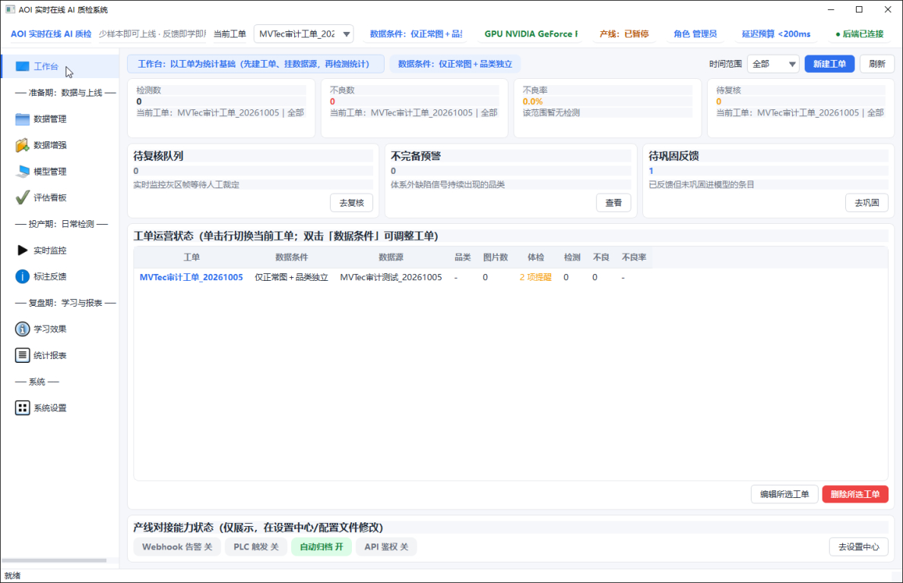
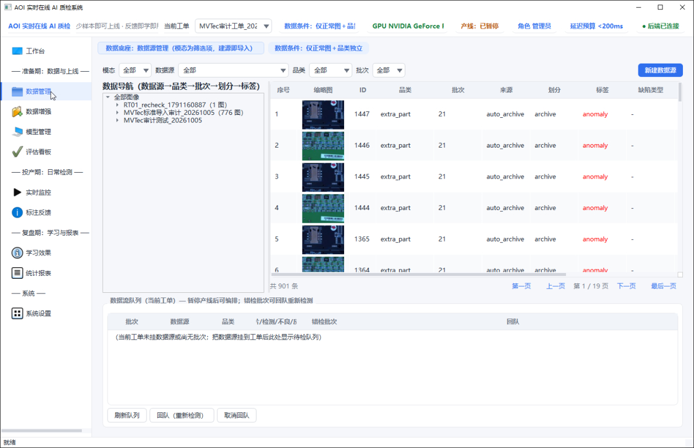
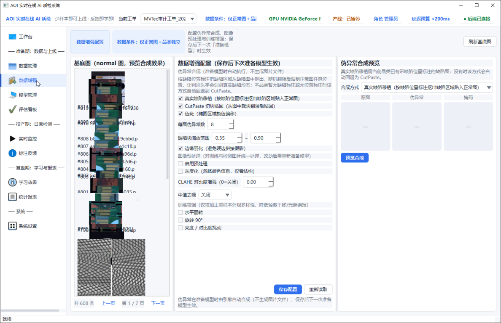
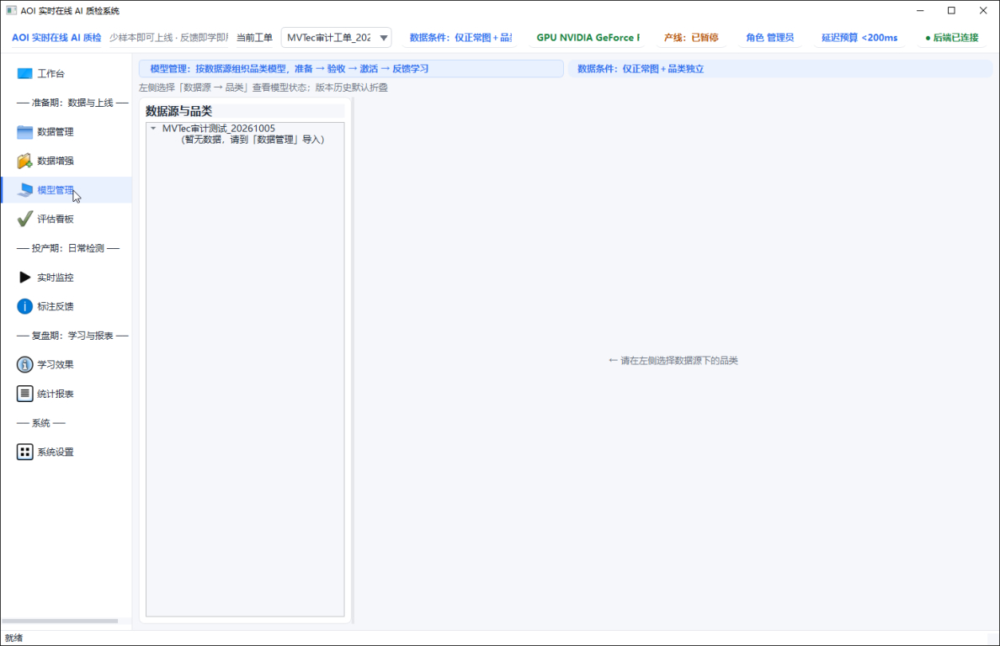
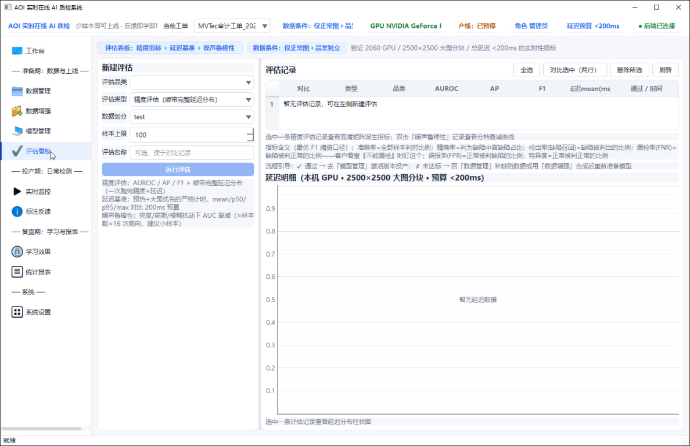
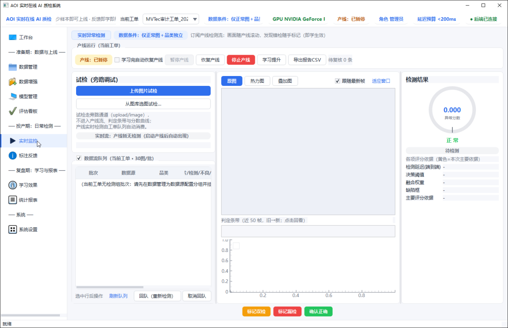
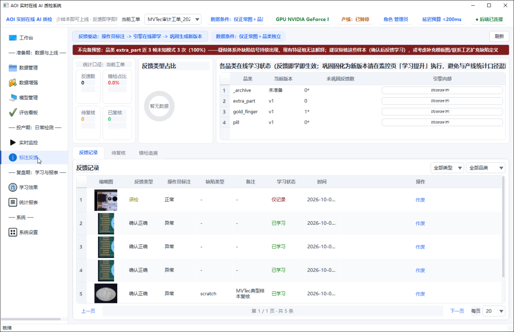
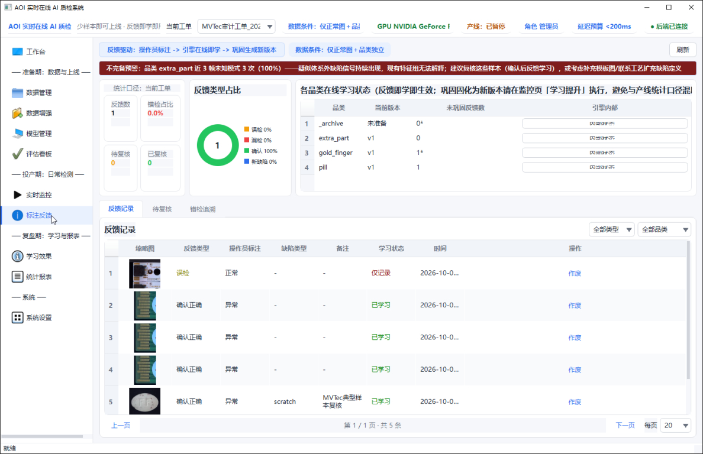
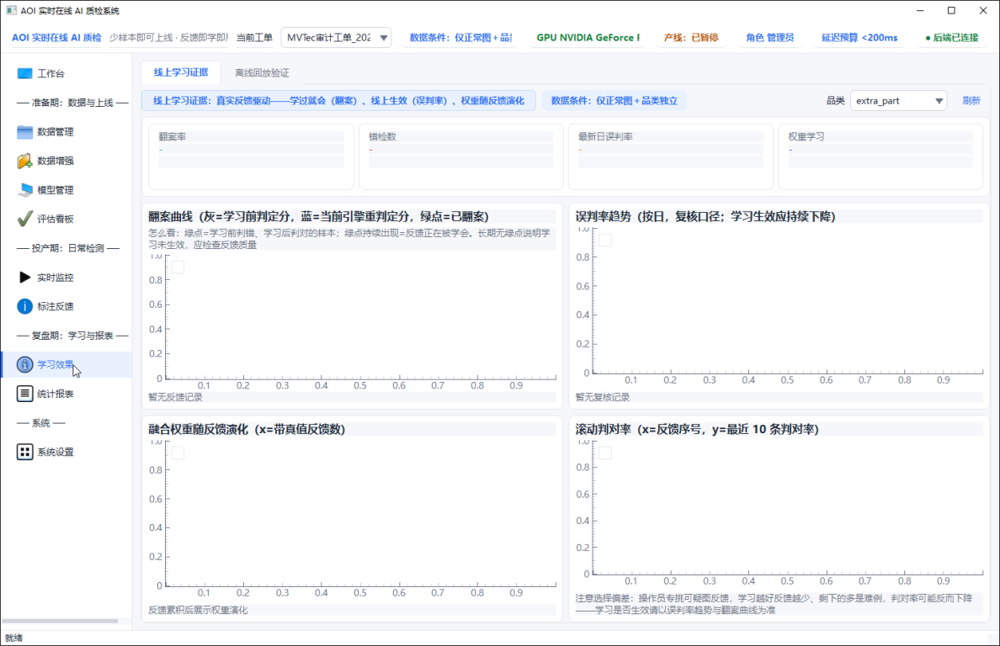
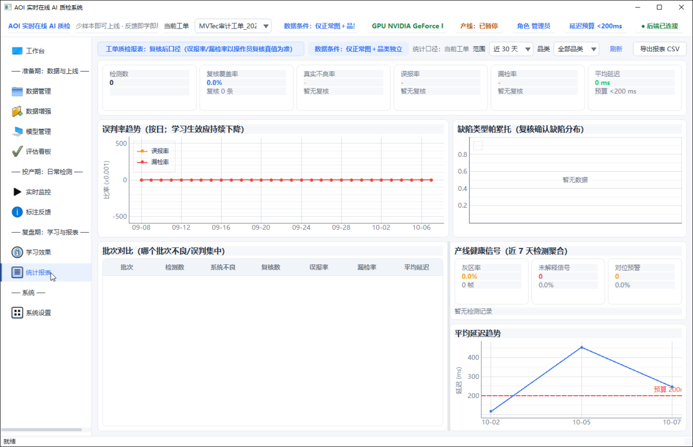

# AOITree 答辩文档（讲稿底稿）

> 用途：答辩讲解与 PPT 的统一底稿。每节先给“一句话讲法”，再给支撑证据。
> 数据口径：除特别注明外，均来自项目文档、实验结果 JSON 与本轮实测；所有数字都标注了数据集与条件。

---

## 0. 一句话定位

**AOITree 是一套“少样本即可上线、错了能教、教坏能退”的工业外观 AI 质检系统。**
100 张正常图 + 30 张缺陷图、十几秒准备，就能开始检测；操作员点一下“误检/漏检”，系统当场吸收；每次更新都要过“考试”（锚定集回归），不及格自动回滚。

---

## 1. 我们解决什么问题（痛点）

| 产线现状 | 带来的问题 | AOITree 的回应 |
|---|---|---|
| 换型频繁，新品类缺陷样本少 | 传统深度模型要大量标注、要训练几小时 | 冻结通用视觉大模型，只做“统计拟合”，100+30 张、约 14s 准备完成 |
| 缺陷种类杂（划痕、色偏、缺件、错序、尺寸偏差） | 单一算法总有盲区 | 多个“专家”各管一类，分数统一后融合 |
| 上线后误检/漏检，只能等工程师调参 | 现场问题无法快速闭环 | 操作员反馈即学（SSOCL），机器复判也能当反馈 |
| 模型自我更新怕“越学越差” | 不敢在产线上开在线学习 | 锚定集门控 + 版本快照 + 自动回滚，全程留痕 |
| 算法和软件是两张皮 | 演示能跑，产线难用 | 桌面端 + 后端服务 + 数据库一体，覆盖建单到追溯全流程 |

讲法：**评委关心的不是“又一个高分模型”，而是“新产线拿来能不能用、用错了怎么办”。我们的设计全部围绕这两件事。**

---

## 2. 系统全景：一张图看懂


**系统组成**
- 前端：PySide6 桌面端，按“准备期 → 投产期 → 复盘期”组织页面。
- 后端：FastAPI 服务（端口 8017）+ SQLite，负责检测、反馈、版本、审计。
- 引擎：DINOv2 冻结特征 + 多专家槽位 + SSOCL 受控持续学习。

**一张图片的旅程（检测流程）**

```text
图片输入
  → 数据隔离检查（测试图不许进入训练）
  → 切块 + DINOv2 提特征（主干冻结，不训练）
  → 各专家槽位打分 + 出热力图（sem / disc / blob / trad / layout / inp / tpl …）
  → 每个槽位做 CDF 校准（把不同量纲的分数换成同一把“尺子”）
  → 共识融合（等权保底 + 按一致度加权）
  → 双阈值判定：正常 / 灰区（交给人看）/ 异常
  → 输出：判定 + 缺陷框 + 类型 + 主导专家 + 追溯记录
  → 操作员反馈（判对 / 判错 / 不反馈）
  → SSOCL 更新候选版本 → 锚定集考试 → 通过则上线，不通过则回滚
```

**一个工单的旅程（使用流程）**：建数据源 → 建工单 → 准备模型（100+30）→ 实时检测 → 标注反馈 → 学习提升 → 回队复检 → 报表与追溯。

---

## 3. 原理：为什么它有效（深入浅出版）

### 3.1 冻结大模型 = “请一位见多识广的老师傅，不重新培训他”

- 比喻：DINOv2 像看过上亿张图的老师傅，天生知道“正常的纹理长什么样”。我们不教他新本事（不微调），只让他看 100 张正常图，记住“这条线上的正常样子”。
- 原理：把正常图切块提特征，存进记忆库（coreset）；检测时，新图每一块去记忆库找最近的邻居，**离得越远越可疑**（sem 槽位，借鉴 PatchCore）。
- 证据（U11 对照实验，同数据同协议）：

| 主干策略 | AUROC | 说明 |
|---|---|---|
| 冻结 DINOv2（本方案） | **0.6032** | fit 约 14s，免去约 256s 训练 |
| 微调 | 0.4914 | 小样本下过拟合 |
| 从零训练 | 0.4235 | 数据不够 |

结论：**小样本下“不训练”反而更稳更快**。这是“少样本即可上线”的根基。

### 3.2 多专家槽位 = “会诊”，每位专家各管一类病

| 专家（槽位） | 擅长 | 一句话原理 |
|---|---|---|
| sem | 一般外观缺陷 | 和正常块比距离 |
| disc | 一般外观缺陷 | 用合成的“假缺陷”训练一个判别头（借鉴 RealNet） |
| blob | 微小斑点、污染 | 全分辨率高斯差分找斑点 |
| trad | 色偏、纹理 | 颜色直方图、纹理、频域等手工特征 |
| layout | 缺件、尺寸、错序 | 元件个数/尺寸/顺序统计比对（不需要模板） |
| inp | 局部结构异常 | 图像内部自相似，“这块和周围不像” |
| tpl | 强配准品类（PCB） | 和金样板做差（仅在有模板时启用） |
| E_open | 没人认识的新缺陷 | 兜底哨兵，“有异常但说不清是什么” |

为什么不用一个大模型包打天下：赛题五类异常（外观、色彩、尺寸、缺件、逻辑）**机理完全不同**，色偏对语义特征不敏感，错序对纹理特征不敏感。会诊比单兵可靠。

### 3.3 CDF 校准 + 共识融合 = “先统一尺子，再投票”

- 问题：各专家分数量纲不同（有的 0~1，有的 0~1000），直接相加没有意义。
- 做法：每个槽位用正常样本的分布做 **CDF 校准**，把分数换成“比多少比例的正常样本更异常”，截断到 [-1, 2]。注意：这是相对排名尺子，**不能当成“缺陷概率”解读**。
- 融合：`w_i = (1-β)/N + β · a_i / Σa`，β = 0.5。一半权重平均分（保底，防止某专家被误判没用），一半按各专家在本品类的一致度/区分度分配。
- 判定：双阈值，τ_h = 正常分位 Q0.99，τ_g = Q0.95。
  - 低于 τ_g：正常；高于 τ_h：异常；中间：**灰区**，交给人复核，也是主动学习的选样来源。

### 3.4 SSOCL 受控持续学习 = “错题本 + 月考 + 退学机制”

- 错题本：反馈分三类——判错（进缺陷样例库，建立近邻拦截）、判对（加固正常模式）、无反馈（满足一致性和置信条件才缓存）。
- 月考：每次更新先生成候选版本，在**锚定集**上回归；指标下降（如 AUROC 或缺陷召回下降）就拒绝。
- 退学机制：已上线版本有快照，随时回滚；所有更新留审计记录，能查到“这个参数见过哪些数据”。
- 机器复判：PCB_Dual 传统 CV 引擎独立判断，AI 与 CV 不一致时自动生成误检/漏检反馈——**产线上已有的老 AOI 也能当老师**。

### 3.5 数据隔离 = “考试不许偷看答案”

- 代码级断言：测试域数据一旦进入 fit 就直接报错（isolation.py）。
- 来由：V4 版本曾出现 0.9983 的“虚高”分数，排查发现评估数据混入了拟合流程。此后建立隔离规则，所有结果均按“val 选参、test 只验不选”重跑。
- 讲法：**我们主动把自己最漂亮的分数废掉了**，这是对评委最有说服力的诚信证据。

---

## 4. 创新点（评委最关心“新在哪”）

讲法：单个零件大多有出处（PatchCore、RealNet、AHL、DINOv2），**我们的创新在“组合方式”和“把它做成能在产线闭环的系统”**。不要宣称发明了新网络。

| # | 创新点 | 和常见做法的区别 | 证据 |
|---|---|---|---|
| 1 | 槽位制多专家 + CDF 统一尺子 | 常见方案单模型单分数；我们可插拔多专家，按缺陷机理分工 | 五类异常检出率 0.938~1.000 |
| 2 | 场景分层冷启动（L0/L1a/L1b/L3） | 常见方案只有一种数据假设；我们按“用户手里有什么数据”自动选档 | 仅正常图也能应急上线；有模板自动启用 tpl |
| 3 | 域差感知软路由 + E_open 哨兵 | 常见方案对“没见过的缺陷”沉默；我们会报“疑似体系外缺陷” | UI 不完备预警横幅 |
| 4 | SSOCL 受控持续学习 | 常见在线学习无门控；我们“先考试再上岗，不及格回滚” | bottle 错标压力测试触发 2 次回滚 |
| 5 | 机器复判当老师 | 反馈只能靠人；我们让传统 AOI 的分歧自动变反馈 | PCB_Dual 机器复判接口已落地 |
| 6 | 实时工程闭环 | 算法 demo 与软件分离；我们一体化，从建单到追溯 | GPU 模型段 p50 58ms / mean 102ms |

---

## 5. 实测证据（每个数字都带口径）

### 5.1 少样本冷启动（赛题默认 100 正常 + 30 缺陷）

五个品类（bottle / capsule / cable / transistor / screw）平均 AUROC：

| 方法 | 平均 AUROC | 是否需要训练 |
|---|---|---|
| PatchCore | 0.9514 | 否 |
| **AOITree** | **0.9441** | 否（fit 约 14s） |
| EfficientAD-S | 0.8748 | 是 |

讲法：**静态精度与 PatchCore 同一水平（略低 0.007），但我们多了反馈学习、类型归因、灰区和回滚**——单看静态分数不是我们的主战场。

### 5.2 公开数据集（无泄漏口径）

| 数据集 | 全槽位 | 速度工作点 | 说明 |
|---|---|---|---|
| MVTec AD | 0.9701 | 0.9811 | 项目文档 sanity 全量口径 0.9793，15/15 ≥0.9 |
| BTAD | 0.9609 | 0.9679 | 3/3 ≥0.9 |
| MPDD | 0.9797 | 0.9908 | 项目文档口径 0.9851，6/6 ≥0.9 |
| data_local（真实工业） | 0.4035 | 0.3438 | 强域差，静态基线如实登记 |
| GYU-DET（跨域） | 0.5594 | 0.6110 | 跨域，靠在线学习提升 |

讲法：**标准数据集上和主流方法同档；真实工业数据静态分很低，我们不藏，而是用它证明“为什么必须有在线学习”。**

### 5.3 在线学习：错了能教

| 实验 | 学习前 | 学习后 | 说明 |
|---|---|---|---|
| GYU-DET 10 轮 300 条反馈 | 0.545 | 0.710 | 非单调，有波动；disc_ft 应用 18 次、拒绝 4 次 |
| GYU-DET U62（单轮调优） | 0.636 | 0.818 | 峰值 0.820 |
| data_local gold_finger | 0.122 | 0.608（单轮）/ 约 0.72（多轮，大锚定） | 早期小锚定 0.91 已主动废弃 |
| data_local solder_smt | 0.235 | 0.531 | |


### 5.4 受控：教坏了能退（bottle 双臂学习协议，结论 PASS）

| 实验臂 | 做法 | 结果 |
|---|---|---|
| 正确反馈臂 | 给正确标注 | 流内错误 1 → 0，锚定 AUROC 保持 1.0；有 1 次因 AUC 不达标被拒 |
| 错标压力臂 | 故意给错误标注 | 门控触发 **2 次回滚**（原因：缺陷召回下降） |

另：数据隔离测试 2/2 通过。
边界：单品类、单随机种子、锚定集仅 4 张——**证明机制有效，不证明统计意义上的普遍性**。

### 5.5 速度（赛题：模型运行 <200ms，单图 <1s）

| 口径 | 硬件 | 结果 |
|---|---|---|
| 模型段（速度模式，2500²） | GTX 1660S | p50 58ms / mean 101.6ms / p95 183.2ms / max 263.1ms |
| 端到端（2500²） | GTX 1660S | mean 162.5ms / p95 241.3ms |
| 大图零拷贝（4096×3000） | GTX 1660S | e2e mean 131ms / p95 172ms |
| CPU 降配（无 GPU） | CPU | 模型段 256.5ms / e2e 351.3ms |
| 本轮复测（pill，经 API） | RTX 2070 | 模型段 121~147ms，e2e 155~251ms；首图预热 6.99s |
| 长稳 | — | 10min × 4 并发 4539 次 0 错误，内存无增长 |

注意：max 263ms 超过 200ms，均值与 p95 达标；突发 4 并发客户端 max 1740ms，**演示与产线建议串行/限流**。

### 5.6 五类异常覆盖

| 缺陷类型 | 检出率 | 类型归因 top-1 |
|---|---|---|
| 常见外观 | 0.958 | 0.836 |
| 尺寸偏差 | 1.000 | 0.787 |
| 缺件少件 | 1.000 | 0.857 |
| 色彩变化 | 1.000 | 0.750 |
| 逻辑错误 | 0.938 | 0.562（样本仅 16 张） |

---

## 6. 系统演示路径（按产线一天的工作顺序）

| 步骤 | 页面 | 讲什么 | 截图 |
|---|---|---|---|
| 1 | 工作台 | 开机首屏：工单、品类状态机、下一步引导 |  |
| 2 | 数据管理 | 智能识别目录格式（MVTec / YOLO / 命名规则），确认后入库 |  |
| 3 | 数据增强 | 缺陷样本不足时合成扩充 |  |
| 4 | 模型管理 | 100+30 准备模型，约 14s 完成并给出体检结论 |   |
| 5 | 评估看板 | 模型上线前的指标与阈值 |  |
| 6 | 实时监控 | 逐图判定、热力图、缺陷框、延迟、主导专家 |  |
| 7 | 标注反馈 | 操作员点选误检/漏检，不需要懂算法 |    |
| 8 | 学习提升 | 生成新版本，过锚定集考试，可回滚 |  |
| 9 | 学习曲线 | 学习前后对比 |  |
| 10 | 统计报表 | 日报、审计、CSV 导出 |  |

现场演示建议：**提前预热模型**（首图 6~7s 冷启动），串行检测，准备好一组“先错、反馈、再检对”的样例图（见第 9 节待确认）。

---

## 7. 局限与边界（主动说，比被问出来好）

| 局限 | 现状 | 应对 |
|---|---|---|
| 真实工业强域差 | data_local 静态 AUROC 仅 0.40 | 在线学习后 0.53~0.72；有金样板时启用 tpl |
| 模板方案依赖覆盖度 | 闭集模板覆盖 1.0，仅用隔离训练正常图作模板仅 0.27 | 模板只作可选增强，不混报 |
| 对光照/位移扰动敏感 | gold_finger 扰动下漏检率最高 0.93 | TTA 可把误报降回基线，但超 1s，仅用于复检工位；产线需光照/对位约束 |
| 类型归因偏弱 | 逻辑错误 top-1 仅 0.562 | 样本少（16 张），持续积累 |
| 定位精度 | patch 级（14~28px） | 满足框选，不做像素级精分割 |
| 在线学习非单调 | 跨域 MPDD bracket_brown 登记 −0.34 负增益 | 门控降风险但非硬保证；锚定集需补缺陷样本 |
| 稳定性 | 10min 压测通过，24h 未实跑 | 工具已就绪 |
| 部署形态 | RTSP、MES 真实协议、RTX 2060 未实测；视频无时序建模 | 接口与模拟网关已完成 |
| 校准异常样例 | 本轮 pill v1 模型 sem 分数全部打满 2.0，good/002 误判异常（0.948） | 正好说明需要反馈纠正与体检；不作展示样例 |

---

## 8. 评委可能会问（准备好的答案）

**Q1：你们和 PatchCore 有什么区别？不就是 PatchCore 加了点东西？**
A：sem 槽位确实借鉴 PatchCore，静态精度也同档（0.9441 vs 0.9514）。区别在 PatchCore 是“一次拟合、静态使用”，而我们在它之上解决了产线三件事：多类型缺陷（多专家 + 归因）、上线后纠错（SSOCL 反馈即学）、更新安全（锚定门控 + 回滚）。

**Q2：为什么 data_local 只有 0.40？是不是模型不行？**
A：这是真实工业数据，和预训练分布差异大，我们如实登记静态基线。这恰恰是在线学习的价值场景：gold_finger 从 0.12 学到约 0.72（大锚定口径）。我们也主动废掉了小锚定下 0.91 的虚高数字。

**Q3：在线学习会不会学坏？**
A：会有风险，所以设计了门控。错标压力实验中，系统触发 2 次自动回滚。但我们不承诺“越学越准”：跨域 bracket_brown 仍有负增益，已如实登记，后续需要在锚定集中补充缺陷样本。

**Q4：100+30 之外有没有偷用目标数据？**
A：没有。预训练只用公开集正常图（赛题允许），目标品类阶段只用 100+30；测试集进入 fit 会被代码断言直接拦截。V4 的 0.9983 虚高正是这样被发现并废弃的。

**Q5：速度怎么算的？max 超过 200ms 怎么解释？**
A：赛题口径是模型运行时间，速度模式均值 102ms、p95 183ms 达标；max 263ms 出现在少量大图上。端到端（含读图和前后处理）均值 162ms，远低于 1s 红线。并发突发场景不作承诺，产线按串行/限流部署。

**Q6：操作员需要懂算法吗？**
A：不需要。三级角色，操作员界面只有“标记误检/漏检/确认正确”三个按钮，灰区样本会自动推送给人复核。

**Q7：新缺陷类型（没见过的）怎么办？**
A：E_open 哨兵兜底，命名专家都解释不了但 E_open 偏高时，系统报“疑似体系外缺陷”；同类样本积累后可孵化新专家。

**Q8：落地成本？**
A：主干 22M 参数冻结，可训练参数 <0.5M；GTX 1660S 级显卡即可实时，无 GPU 时 CPU 降配 e2e 351ms 也能用。新品类上线从“工程师周级调参”变成“分钟级准备”（不含数据导入与人工核对）。

---

## 9. 待你确认的事项

1. **MVTec / MPDD 主报数字**：bench 汇总为 0.9701 / 0.9797（全槽位），项目文档 sanity 全量为 0.9793 / 0.9851。PPT 主报哪一套？建议主报项目文档口径并在脚注注明，与提交文档一致。
2. **GYU-DET 学习后数字**：主报 10 轮 300 反馈的 0.545→0.710（更保守、过程完整），还是 U62 的 0.636→0.818（更好看）？建议主报前者，后者作为调优补充。
3. **实时监控带热力图的截图**：现有 06_实时监控.jpg 与项目文档 07 号图都是空闲态，没有检测结果。是否需要你在 UI 上手动上传一张图检测后截图补上（自动化无法操作系统文件对话框）？
4. **演示用样例**：本轮 pill v1 校准异常，不适合现场展示。建议改用 bottle（学习协议已验证 PASS）作演示品类，是否同意？
5. **PPT 风格与页数**：建议“正式工作汇报”风格，约 15~18 页，按本文档 0→8 节顺序；是否另需讲稿备注？
6. **团队分工与赛题信息**：PPT 封面和分工页需要队名、成员、赛道名称（企业赛题“火眼工坊”还是开放赛题）。

