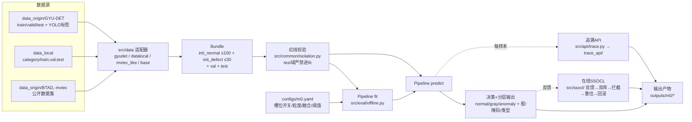

# Demo5 数据流与文件关系简要说明

> 版本：v1.0（2026-08-26）· 配套：`demo5设计.md`（设计）、`模型使用说明.md`（使用）
> 一句话：**数据源 → 适配器打包 → 红线校验 → 分块提特征 → 槽位评分 → CDF 校准 → 融合 → 决策 → 分层输出 → 追溯/在线学习**，全程产物落在 `outputs/m0/`。

## 1. 数据流总览



## 2. 离线冷启动（fit）数据流

```
train/good(≤100) + init_defect(≤30)          # 赛题协议，全部来自 train 域
  → 分块 tiling（single / tiles9 / tiles36，粒度是速度-精度旋钮）
  → 特征提取 backbone：DINOv2 patch token（永冻）/ PDN / 纯手工（CPU 降配）
  → 各槽位 fit：sem / disc / blob / trad / layout / inp / tpl / shead / color …
  → 槽位评分 → CDF 校准（红线：只统计 train/good 分数）
  → 融合权重：等权保底 / sanity 加权 / 共识自适应 / 软路由（仅追溯）/ 域差倾斜
  → 阈值：train/good 融合分位数（tau_high / tau_gray 双阈值 + 灰区）
  → 槽位体检 slot_sanity + train 域 fused AUROC（协议内报告，不改决策）
```

## 3. 在线推理（predict）数据流

```
图片/视频帧
  → 读图 → 分块 → DINO 前向（GPU 主线程） ∥ trad/blob/layout（CPU 线程池并行，U56）
  → 每槽位 {score, heatmap, confidence}（红线：槽位三件套）
  → 校准分 [0,1] → 融合分 fused（权重同 fit 口径）
  → M3 拦截加分（确认缺陷近邻，正常库抵消相对相似，U25）
  → 决策：anomaly / gray / normal（灰区→主动选样/人工）
  → 分层输出 L2 定位（热力图→掩码→检测框）+ L3 类型归因（缺陷判别器/规则映射）
  → E_open 哨兵：open_score 高但判 normal → open_alert（不完备报告）
  → 逐样本落盘 trace_api/inferences.jsonl（红线 5）
```

## 4. 在线学习（SSOCL）数据流

```
三类反馈 correct / wrong / none（可带 label / 框）
  → 判错缺陷 1-2 张入库（缺陷样例库 → 近邻拦截即时生效）
  → 判对正常回流 → 双库制（锚定库 + 扩展库），成簇入库，孤立高分不入库
  → CDF 重估 + sem 扩展 → 锚定集回归门控，退化回滚
  → 难例攒够 → 路由微调 / AHL 式孵育头
  → 灰区样本 → 主动选样队列 → top-N 询问清单
  → 学习曲线：m3_*.json/png（在线拦截）、m5_learning_*.json/png（持续学习）
```

## 5. 文件关系

### 目录结构（demo5/）

```
demo5/
├── configs/            # *.yaml 管线配置（槽位开关、tiling 粒度、融合、阈值、TTA、SSOCL）
├── src/                # 生产代码（无可视化）
│   ├── data/           # 适配器 base / gyudet / datalocal / mvtec_like → Bundle
│   ├── common/         # io 读图 / tiling 分块 / isolation 红线断言
│   ├── backbone/       # dino（主）/ pdn（CPU 路径，已弃用）
│   ├── slots/          # 评分槽位：sem disc blob trad layout inp tpl shead color open
│   ├── fusion/         # calibrate CDF / fixed 等权 / consensus 共识 / router 软路由
│   ├── decision/       # hierarchical 分层输出 / defect_classifier 类型判别器
│   ├── eval/           # offline.Pipeline 主管线 / metrics / contribution 贡献档案
│   ├── ssocl/          # feedback 反馈 / banks 双库 / active 主动 / incubate 孵育 /
│   │                   # attribution 归因 / block_learning / learning_curve
│   ├── api/trace.py    # 追溯 API（上位机查询）
│   ├── video/          # video_pipeline 视频关键帧检测
│   └── decide.py       # Decider 双阈值 + TraceLogger
├── scripts/            # 实验/测试脚本（入口 + 可视化，见 §6）
├── outputs/
│   ├── m0/             # 全部实验结果产物（见 §7）
│   └── sota/           # SOTA 对比（patchcore_fewshot100.json 等）
└── stage5/             # 文档：demo5设计.md / 模型使用说明.md / 本文件等
```

### 关键入口文件

| 文件 | 作用 |
|------|------|
| [m0_baseline.py](file:///d:/CGAIC/demo5/scripts/m0_baseline.py) | 主入口：build(主干+槽位) → Pipeline.fit → eval，产出 `outputs/m0/m0_*.json` |
| [offline.py](file:///d:/CGAIC/demo5/src/eval/offline.py) | 核心管线：fit / predict / evaluate / enable_ssocl / feedback / contribution_report |
| [dino.py](file:///d:/CGAIC/demo5/src/backbone/dino.py) | FrozenDINO 特征提取（DINOv2 本地 hub 缓存，无网络可跑） |
| [slots/](file:///d:/CGAIC/demo5/src/slots/) | 7+ 槽位，统一 `score_tiles -> (tile_scores, heatmaps)` 契约 |
| [consensus.py](file:///d:/CGAIC/demo5/src/fusion/consensus.py) | 共识自适应权重（无标签，train/good 校准分） |
| [router.py](file:///d:/CGAIC/demo5/src/fusion/router.py) | 线性软路由（MIL 训练，仅追溯不参与融合分） |
| [feedback.py](file:///d:/CGAIC/demo5/src/ssocl/feedback.py) | 在线反馈闭环：双库 + 拦截 + CDF 重估 + 回归门控回滚 |
| [trace.py](file:///d:/CGAIC/demo5/src/api/trace.py) | 追溯 API：inferences.jsonl / update_log / system_state / export |

## 6. 脚本与产物的对应关系

| 脚本 | 用途 | 产物（outputs/m0/） |
|------|------|---------------------|
| m0_baseline.py | 冷启动基线评测 | `m0_{数据集}_{品类}_{mode}.json`、`trace_{name}_val.jsonl`、`contribution_*.json` |
| m3_ssocl_sim.py | 在线拦截仿真 | `m3_{品类}_{feedback}.json/.png` |
| m5_learning_curve.py | 持续学习曲线 | `m5_learning_*.json/.png` |
| pretrain_disc.py | disc 跨品类预训练 | `disc_pretrain.pt` |
| exp_cpu_speed.py | CPU 降配速度 | `m4_cpu_speed.json` |
| exp_prune / exp_router / exp_generalize 等 | 专项消融 | `m4_*.json`、`m5_ablate_*.json` 等 |
| m4_trace_demo.py | 追溯 API 演示 | `trace_api/{inferences.jsonl, audit.json}` |

## 7. outputs/m0/ 主要产物说明

| 产物 | 含义 |
|------|------|
| `m0_*_single/tiles9/tiles36.json` | 各数据集/品类评测报告（fused + 每槽 AUROC、速度 ms/图） |
| `final_summary.json` / `final_comparison.md` | 最终汇总与对比 |
| `bench_2500.png` | 2500² 粒度-速度基准 |
| `m3_*.json/png`、`m5_learning_*.json/png` | 在线/持续学习曲线（核心交付物） |
| `defect_clf.pkl` | 全局有监督类型判别器（跨品类聚合训练，fit 时优先加载） |
| `disc_pretrain.pt`、`u86v*_head.pt`、`pdn_distill_*.pt` | 训练产物（disc 预训练、孵育头、PDN 蒸馏） |
| `trace_api/inferences.jsonl`、`audit.json` | 推理追溯 + 全量审计导出 |
| `trace_*_val.jsonl` | 评测过程逐样本记录 |
| `synth_*.mp4` | 合成缺陷视频（视频演示） |

## 8. 依赖关系要点

- 数据：`D:\CGAIC\data_origin\GYU-DET`（YOLO txt 标注）、`D:\CGAIC\data_local`（自采，`{category}/{train,val,test}`）、`data_origin/BTAD、mvtec`（公开，跨品类预训练/泛化验证）
- 模型：DINOv2 走本地 hub 缓存；`defect_clf.pkl` 从 `outputs/m0/` 加载，缺省回退 per-category 训练
- 配置：所有管线行为由 `configs/*.yaml` 控制（同一份代码，不同工作点）
- 红线：`src/common/isolation.py` 的 `guard_bundle` 是唯一数据闸门——适配器产物必须先过它才能进 fit/eval，违规即抛错
