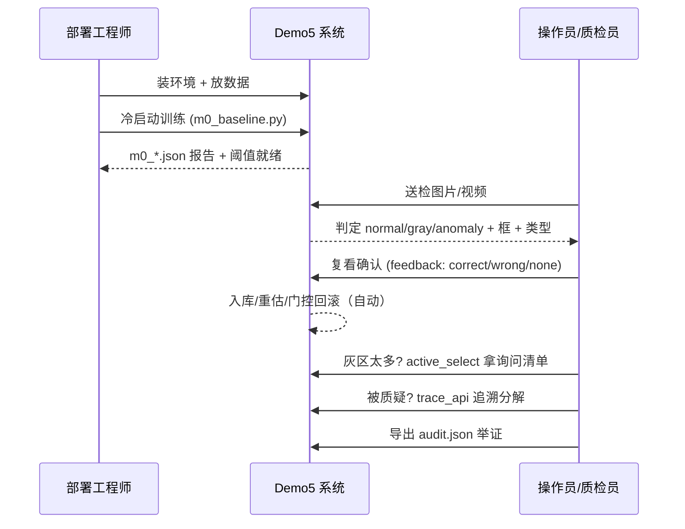

# Demo5 用户操作流说明

> 版本：v1.0（2026-08-26）· 读者：操作员 / 上位机集成者 / 质检管理员
> 定位：以"操作者视角"讲清 **部署 → 训练 → 检测 → 反馈 → 追溯** 的完整操作流程与每个动作的结果。
> 配套：[模型使用说明.md](file:///d:/CGAIC/demo5/stage5/模型使用说明.md)（接口/参数细节）、[demo5数据流与文件关系.md](file:///d:/CGAIC/demo5/stage5/demo5数据流与文件关系.md)（数据流/文件关系）

## 1. 操作角色

| 角色 | 做什么 |
|------|--------|
| 部署工程师 | 装环境、放数据、跑冷启动训练（§2–§3） |
| 操作员 | 日常送检（图片/视频）、看判定结果（§4） |
| 质检管理员 | 处理灰区/异议样本、打反馈、看追溯（§5–§7） |

## 2. 部署准备（一次）

```bash
# 环境：Python 3.11 + PyTorch(CUDA) + opencv/numpy/sklearn/skimage/pyyaml/matplotlib
pip install torch torchvision opencv-python numpy scikit-learn scikit-image pyyaml matplotlib

# 数据目录（红线：目录结构必须如此）
D:\CGAIC\data_local\{品类}\{train,val,test}\good\...     # 自采数据
D:\CGAIC\data_origin\GYU-DET\{train,valid,test}\{images,labels}   # 公开数据集
# DINOv2 本地 hub 缓存（无网络可跑）
```

## 3. 冷启动训练（每品类一次，≤100 正常 + ≤30 缺陷）

```bash
cd D:\CGAIC\demo5
python scripts/m0_baseline.py --dataset datalocal --category gold_finger --mode tiles9
python scripts/m0_baseline.py --dataset gyudet --mode single
```

**训练完成时系统自动做好**：槽位评分器 → CDF 校准（只统计正常图）→ 融合权重 → 双阈值（anomaly / gray 分界）→ 类型判别器。产物：`outputs/m0/m0_*.json`。

> 质检管理员注意：冷启动后即可上机。此时缺陷学习量为零，**判错不可怕**——正是 §5 的反馈把它救回来。

## 4. 日常检测

### 4.1 图片

```python
from scripts.m0_baseline import build
from src.eval.offline import Pipeline
import yaml

cfg = yaml.safe_load(open("configs/m0.yaml"))
backbone, slots = build(cfg, "cuda")
pipe = Pipeline(cfg, backbone, slots)
pipe.fit(bundle)                                # bundle 由适配器生成（见数据流文档 §2）

r = pipe.predict(r"D:\CGAIC\data_local\gold_finger\test\defect\xxx.jpg")
```

### 4.2 视频

```python
from src.video.video_pipeline import VideoInspector
out = VideoInspector(pipe, step=5, alpha=0.5).inspect("video.mp4")
# out: {frames: 帧级判定/框/类型, summary: 异常帧率/主导类型/final_decision}
```

### 4.3 判定结果怎么读

| 输出字段 | 含义 | 操作员动作 |
|---------|------|-----------|
| `decision = normal` | 无异常 | 放行 |
| `decision = gray` | 灰区（分数介于阈值间） | **请人工复看**，复看结论打反馈（§5） |
| `decision = anomaly` | 判异常 | 看 `boxes`（检测框）`types`（类型+证据）复核 |
| `boxes` | 缺陷检测框（原图坐标） | 定位复核位置 |
| `types` | 类型归因（如 缺件/色彩/外观 + 置信度） | 判断归因是否合理 |
| `open_alert = true` | 判正常但存在"未解释信号"（E_open 哨兵） | 提示体系外新模式，建议人工确认 |

## 5. 反馈操作（在线学习核心，三类反馈）

启用在线学习后：

```python
pipe.enable_ssocl(ssocl_cfg, train_normal_paths=bundle["init_normal"])
```

每次复看结论后打一条反馈，系统自动学习、自动回滚防护：

| 复看结论 | 调用 | 系统自动做什么 |
|---------|------|--------------|
| **判对了**（normal 确认正常 / anomaly 确认缺陷） | `pipe.feedback(path, verdict="correct", label=0或1)` | 正常 → 回流评估（成簇入库 + CDF 重估）；缺陷 → 入缺陷样例库 |
| **判错了**（normal 实为缺陷 / anomaly 实为正常） | `pipe.feedback(path, verdict="wrong", label=1或0, box=框可选)` | 难例入缺陷库 → 近邻拦截**秒级生效**（同类再来即加分拦截：1-2 张先脱离误判，6-13 条积累即"下批检对"）；攒够触发路由微调/归因分析 |
| **无法确认** | `pipe.feedback(path, verdict="none")` | 进主动选样队列（见 §6） |

**每次更新自动过回归门控**：锚定集正常分分布漂移超限 → 自动回滚并留痕，不怕喂错。

> 实测效果：仅 6/13 条反馈，gold_finger F1 +0.48 / solder_smt +0.37（"这批错检、下批检对"）。

## 6. 主动选样（把反馈预算花在刀刃上）

```python
ask_list = pipe.active_select(top_n=10)   # 灰区中"最不确定 × 最有代表性"的 10 张
# 对清单逐张人工确认 → 确认结果照 §5 打 feedback 即可
```

**原则**：灰区样本才问（高置信样本不浪费人工）；每张只问一次（防重复打扰）。

## 7. 追溯（回溯"为什么判我异常"）

```python
api = pipe.attach_trace_api("outputs/m0/trace_api")

api.recent_inferences(20)   # 逐样本: slot_scores/fused/decision/boxes/types/boost
api.system_state()          # 当前权重/阈值/双库版本/熔断状态（审计用）
api.update_log()            # 反馈/回滚/回归门控历史
api.export("audit.json")    # 全量审计导出（交付/举证用）
```

常见操作：
- 客户质疑某张图 → `recent_inferences` 里查它的**槽位分解 + 主导槽位 + 类型证据**
- 出了系统性误报 → 看 `system_state` 的权重分布，结合学习曲线判断是否在线学习引入漂移

## 8. 性能降配（CPU 环境）

```bash
python scripts/exp_cpu_speed.py --category gold_finger   # configs/m4_cpu.yaml
```

纯手工槽位（blob/trad/layout），无主干无网络。实测 2500² 级 CPU e2e mean 351ms / p95 368ms/图（n=15 复测 2026-08-31，`outputs/m0/bench_2500_cpu.json`，<2s 达标）。**精度劣化如实报告**——CPU 模式是"保速度降精度"的降配档，不是默认路径。

## 9. 完整操作时序



## 10. 操作要点速记

1. **训练只用正常图定阈值**——test 域样本永远不进训练（代码级红线，进 fit 直接报错）。
2. **灰区不是漏检**——是"系统没把握"的信号，专门留给人工，打反馈后系统会学。
3. **判错反馈越早打越值钱**——拦截通道 1–2 张缺陷即建、加分秒级生效（稳定检对随样例积累，与算法引擎设计.md §7.8 实测口径一致）。
4. **主动选样清单要处理**——那是系统认为"最值得你花时间"的样本。
5. **每次更新都留痕可回滚**——喂错不会把系统带崩。
